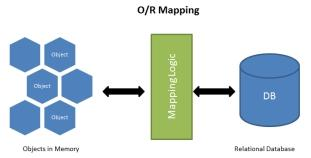

# Gin 中使用 GORM 操作 mysql 数据库

## GORM 简单介绍

GORM 是 Golang 的一个 orm 框架。简单说，ORM 就是通过实例对象的语法，完成关系型数据库的操作的技术，是"对象-关系映射"（Object/Relational Mapping） 的缩写。使用 ORM框架可以让我们更方便的操作数据库。

GORM 官方支持的数据库类型有： MySQL, PostgreSQL, SQlite, SQL Server



## 和原生 SQL 对比

|          | 原生 `database/sql`                 | GORM                   |
| :------- | :---------------------------------- | :--------------------- |
| 写代码   | 手拼 SQL 字符串、手动 Scan 到结构体 | 结构体操作，自动映射   |
| 建表     | 手写 DDL                            | AutoMigrate            |
| 关联查询 | 手写 JOIN，容易错                   | Preload 一行           |
| 学习成本 | 低，但重复劳动多                    | 有一点点，但省大量时间 |

**我的建议**：两个都值得懂——SQL 是地基（你 MySQL.md 在学），GORM 是效率工具。练手项目直接用 GORM，等你遇到复杂查询（报表、聚合），再用 `Raw` 写原生 SQL 兜底，这也是真实项目的通用做法。

**Gorm 特性**

- 全功能 ORM
- 关联 (Has One，Has Many，Belongs To，Many To Many，多态，单表继承) 
- Create，Save，Update，Delete，Find 中钩子方法
- 支持 Preload、Joins 的预加载
- 事务，嵌套事务，Save Point，Rollback To Saved Point 
- Context、预编译模式、DryRun 模式
- 批量插入，FindInBatches，Find/Create with Map，使用 SQL 表达式、Context Valuer 进行 CRUD
- SQL 构建器，Upsert，数据库锁，Optimizer/Index/Comment Hint，命名参数，子查询
- 复合主键，索引，约束
- Auto Migration
- 自定义 Logger 
- 灵活的可扩展插件 API：Database Resolver（多数据库，读写分离）、Prometheus…
- 每个特性都经过了测试的重重考验
- 开发者友好

官方文档：https://gorm.io/zh_CN/docs/index.html

## Gin 中使用 GORM

### 1、安装

**如果使用 go mod 管理项目的话可以忽略此步骤**

```
go get -u gorm.io/gorm
go get -u gorm.io/driver/mysql
```

### 2、Gin 中使用 Gorm 连接数据库

在 models 下面新建 core.go ，建立数据库链接

```go
package models
import ( "fmt"
        "gorm.io/driver/mysql"
        "gorm.io/gorm"
       )
var DB *gorm.DB
var err error
func init() {
    dsn := "root:123456@tcp(192.168.0.6:3306)/gin?charset=utf8mb4&parseTime=True&loc=L
    ocal"DB, err = gorm.Open(mysql.Open(dsn), &gorm.Config{})
    if err != nil {
        fmt.Println(err)
    }
}
```

### 3、定义操作数据库的模型

Gorm 官方给我们提供了详细的：

https://gorm.io/zh_CN/docs/models.html

虽然在 gorm 中可以指定字段的类型以及自动生成数据表，但是在实际的项目开发中，我们是先设计数据库表，然后去实现编码的。

**在实际项目中定义数据库模型注意以下几点：**

**1、结构体的名称必须首字母大写** ，并和数据库表名称对应。例如：表名称为 user 结构体名称定义成 User，表名称为 article_cate 结构体名称定义成 ArticleCate

2、结构体中的**字段名称首字母必须大写**，并和数据库表中的字段一一对应。例如：下面结构体中的 Id 和数据库中的 id 对应,Username 和数据库中的 username 对应，Age 和数据库中的 age 对应，Email 和数据库中的 email 对应，AddTime 和数据库中的 add_time 字段对应

**3、默认情况表名是结构体名称的复数形式**。如果我们的结构体名称定义成 User，表示这个模型默认操作的是 users 表。

4、我们可以使用结构体中的自定义方法 TableName 改变结构体的默认表名称，如下:

```go
func (User) TableName() string {
return "user"
}
```

表示把 User 结构体默认操作的表改为 user 表

**定义 user 模型：**

```go
package models
type User struct { // 默认表名是 `users`
    Id int
    Username string
    Age int
    Email string
    AddTime int
}
func (User) TableName() string {
    return "user"
}
```

关于更多模型定义的方法参考：https://gorm.io/zh_CN/docs/conventions.html

**gorm.Model**
GORM 定义一个 gorm.Model 结构体，其包括字段 ID、CreatedAt、UpdatedAt、DeletedAt

// gorm.Model 的定义

```go
type Model struct {
    ID uint `gorm:"primaryKey"` CreatedAt time.Time
    UpdatedAt time.Time
    DeletedAt gorm.DeletedAt `gorm:"index"` }
```

## GORM 的默认约定

### 一、命名约定（最基础）

| 约定项           | 默认行为                                         | 例子                                             | 覆盖方式                         |
| :--------------- | :----------------------------------------------- | :----------------------------------------------- | :------------------------------- |
| **表名**         | 结构体名 → 小写下划线 + 复数                     | `User` → `users`，`UserOrder` → `user_orders`    | `TableName()` / `NamingStrategy` |
| **主键**         | 名为 `ID`（或 `Id`）的字段自动成为主键，默认自增 | `ID uint` → 主键 `id`                            | `gorm:"primaryKey"`              |
| **列名**         | 驼峰字段 → 下划线列名                            | `UserName` → `user_name`，`AddTime` → `add_time` | `gorm:"column:xxx"`              |
| **外键名**       | 模型名 + 主键名                                  | `User` 的关联 → `user_id`                        | `gorm:"foreignKey:xxx"`          |
| **多对多连接表** | 两个模型名按下划线拼接                           | `User` × `Profile` → `user_profiles`             | `gorm:"many2many:xxx"`           |

### 二、特殊字段约定（写对名字就自动生效）

| 字段名      | 类型             | 自动行为                                                     |
| :---------- | :--------------- | :----------------------------------------------------------- |
| `CreatedAt` | `time.Time`      | 插入时自动写入当前时间                                       |
| `UpdatedAt` | `time.Time`      | 每次更新自动刷新                                             |
| `DeletedAt` | `gorm.DeletedAt` | **软删除**：`Delete` 变成 `UPDATE deleted_at`，所有查询自动加 `WHERE deleted_at IS NULL` |

注意：`DeletedAt` 一旦存在，查出来的数据永远是不带删除标记的——这是新手最容易困惑的一点，看日志会发现查询多了一个条件。

### 三、查询行为约定

- **零值字段被忽略**：`Where("age = ?", 0)` 不生效、`Create` 时零值（`0`/`""`/`false`/`nil`）不写入。要用指针、`sql.NullInt64` 或 `Select` 显式指定
- **`First`**：按主键升序取第一条，查不到返回 `ErrRecordNotFound`
- **`Take`**：不排序直接取一条；**`Find`**：取全部
- **链式方法**：`Where`/`Order`/`Limit` 可自由组合复用，遇终结方法（`First`/`Find` 等）才执行

### 四、其他

- 每个单条操作默认包在**自动事务**里
- `AutoMigrate(&User{})` 自动建表时，同样遵循上面所有命名约定
- 所有"默认"都可通过 `NamingStrategy` 或 struct tag 覆盖，**约定 ≠ 强制**

## Gin GORM CURD

找到要操作数据库表的控制器，然后引入 models 模块

### 1、增加

增加成功后会返回刚才增加的记录

```go
func (con UserController) Add(c *gin.Context) {
    user := models.User{
        Username: "itying.com", Age: 18, Email: "itying@qq.com", AddTime: int(time.Now().Unix()), }
    result := models.DB.Create(&user) // 通过数据的指针来创建
    if result.RowsAffected > 1 {
        fmt.Print(user.Id)
    }
    fmt.Println(result.RowsAffected)
    fmt.Println(user.Id)
    c.String(http.StatusOK, "add 成功")
}
```

更多增加语句:https://gorm.io/zh_CN/docs/create.html

### 2、查找

查找全部

```go
func (con UserController) Index(c *gin.Context) {
    user := []models.User{}
    models.DB.Find(&user)
    c.JSON(http.StatusOK, gin.H{ "success": true, "result": user, })
}
```

指定条件查找

```go
func (con UserController) Index(c *gin.Context) {
    user := []models.User{}
    models.DB.Where("username=?", "王五").Find(&user)
    c.JSON(http.StatusOK, gin.H{ "success": true, "result": user, })
}
```

更多查询语句：https://gorm.io/zh_CN/docs/query.html

### 3、修改

```go
func (con UserController) Edit(c *gin.Context) {
    user := models.User{Id: 7}
    models.DB.Find(&user)
    user.Username = "gin gorm" user.Age = 1
    models.DB.Save(&user)
    c.String(http.StatusOK, "Edit")
}
```

更多修改的方法参考：https://gorm.io/zh_CN/docs/update.html

### 4、删除

```go
func (con UserController) Delete(c *gin.Context) {
    user := models.User{Id: 8}
    models.DB.Delete(&user)
    c.String(http.StatusOK, "Delete")
}
```

更多删除的方法参考:https://gorm.io/zh_CN/docs/delete.html

### 5、批量删除

```go
db.Where("email LIKE ?", "%jinzhu%").Delete(Email{})
// DELETE from emails where email LIKE "%jinzhu%";
db.Delete(Email{}, "email LIKE ?", "%jinzhu%")
// DELETE from emails where email LIKE "%jinzhu%";
func (con UserController) DeleteAll(c *gin.Context) {
    user := models.User{}
    models.DB.Where("id>9").Delete(&user)
    c.String(http.StatusOK, "DeleteAll")
}
```

更多删除的方法参考:https://gorm.io/zh_CN/docs/delete.html

## Gin GORM 查询语句详解

https://gorm.io/zh_CN/docs/query.html

1、Where
=
<
\>
<=
\>=
!=
IS NOT NULL
IS NULL
BETWEEN AND
NOT BETWEEN AND
IN
OR
AND
NOT
LIKE

```go
nav := []models.Nav{}
models.DB.Where("id<3").Find(&nav)
c.JSON(http.StatusOK, gin.H{ "success": true, "result": nav, })
```

```go
var n = 5
nav := []models.Nav{}
models.DB.Where("id>?", n).Find(&nav)
c.JSON(http.StatusOK, gin.H{ "success": true, "result": nav, })
```

```go
var n1 = 3
var n2 = 9
nav := []models.Nav{}
models.DB.Where("id > ? AND id < ?", n1, n2).Find(&nav)
c.JSON(http.StatusOK, gin.H{ "success": true, "result": nav, })
```

2、Or 条件

```go
nav := []models.Nav{}
models.DB.Where("id=? OR id=?", 2, 3).Find(&nav)
```

```go
nav := []models.Nav{}
models.DB.Where("id=?", 2).Or("id=?", 3).Or("id=4").Find(&nav)
```

3、选择字段查询

```go
nav := []models.Nav{}
models.DB.Select("id, title,url").Find(&nav)
```

4、排序 Limit 、Offset

```go
nav := []models.Nav{}
models.DB.Where("id>2").Order("id Asc").Find(&nav)
nav := []models.Nav{}
models.DB.Where("id>2").Order("sort Desc").Order("id Asc").Find(&nav)
nav := []models.Nav{}
odels.DB.Where("id>1").Limit(2).Find(&nav)
```

跳过 2 条查询 2 条

```go
nav := []models.Nav{}
models.DB.Where("id>1").Offset(2).Limit(2).Find(&nav)
```

5、获取总数

```go
nav := []models.Nav{}
var num int
models.DB.Where("id > ?", 2).Find(&nav).Count(&num)
```

6、Distinct

从模型中选择不相同的值

```go
nav := []models.Nav{}
models.DB.Distinct("title").Order("id desc").Find(&nav)
c.JSON(200, gin.H{ "nav": nav, })
```

```go
SELECT DISTINCT `title` FROM `nav` ORDER BY id desc
```

7、Scan

```go
type Result struct {
Name string
Age int
}
var result Result
db.Table("users").Select("name", "age").Where("name = ?", "Antonio").Scan(&result)
// 原生 SQL
db.Raw("SELECT name, age FROM users WHERE name = ?", "Antonio").Scan(&result)
var result []models.User
models.DB.Raw("SELECT * FROM user").Scan(&result)
fmt.Println(result)
```

**Scan 把"查询结果"按列名映射到"你指定的结构体"里。** 它跟 `Find` 最大的区别是：`Find` 只能把结果装回"模型本身"（因为 GORM 要靠模型推断表名、处理软删除、加载关联），而 **Scan 不挑食——任意结构体都能装**。

| 对比项     | `Find`                      | `Scan`                                    |
| :--------- | :-------------------------- | :---------------------------------------- |
| 目标结构体 | 必须是模型（或模型切片）    | 任意结构体 / DTO                          |
| 推断表名   | 从模型自动推断              | 自己不能推断（要配合 `Raw` 或 `Model()`） |
| 关联加载   | 支持（`Preload` 等）        | 不支持                                    |
| 软删除过滤 | 自动加 `deleted_at IS NULL` | `Raw` 场景**不会**自动加                  |
| 典型场景   | 标准 CRUD                   | 原生 SQL、联表、统计、裁剪字段            |

8、Join

```go
type result struct {
Name string
Email string
}
db.Model(&User{}).Select("users.name, emails.email").Joins("left join emails on emails.user_i
d = users.id").Scan(&result{})
SELECT users.name, emails.email FROM `users` left join emails on emails.user_id = users.i
d
```

## Gin GORM 查看执行的 sql

```go
func init() {
    dsn :=
    "root:123456@tcp(192.168.0.6:3306)/gin?charset=utf8mb4&parseTime=True&loc=Local" DB, err = gorm.Open(mysql.Open(dsn), &gorm.Config{
        QueryFields: true, })
    // DB.Debug()
    if err != nil {
        fmt.Println(err)
    }
}
```

# 原生 SQL 和 SQL 生成器

更多使用方法参考：

https://gorm.io/zh_CN/docs/sql_builder.html

1、使用原生 sql 删除 user 表中的一条数据

```go
result := models.DB.Exec("delete from user where id=?", 3)
fmt.Println(result.RowsAffected)
```

2、使用原生 sql 修改 user 表中的一条数据

```go
result := models.DB.Exec("update user set username=? where id=2", "哈哈")
fmt.Println(result.RowsAffected)
```

3、查询 uid=2 的数据

```go
var result models.User
models.DB.Raw("SELECT * FROM user WHERE id = ?", 2).Scan(&result)
fmt.Println(result)
```

4、查询 User 表中所有的数据

```go
var result []models.User
models.DB.Raw("SELECT * FROM user").Scan(&result)
fmt.Println(result)
```

5、统计 user 表的数量

```go
var count int
row := models.DB.Raw("SELECT count(1) FROM user").Row(&count )
row.Scan(&count)
```

