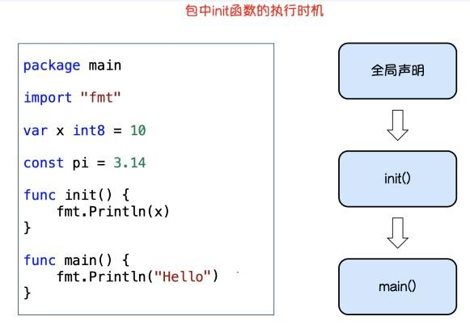
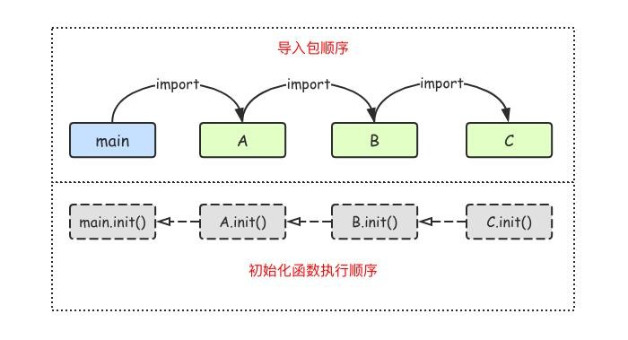
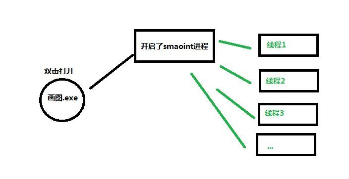
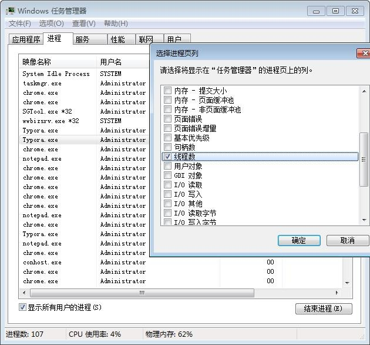
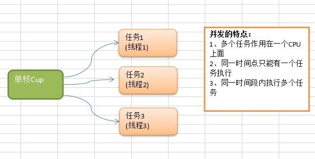
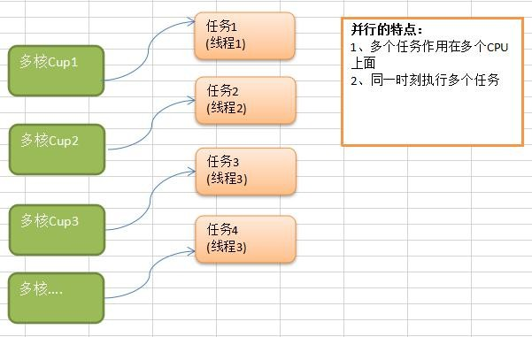
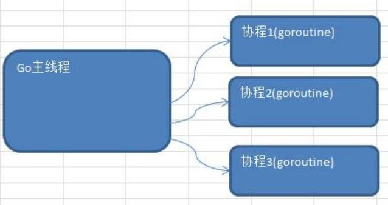
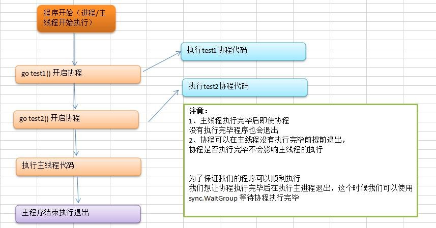
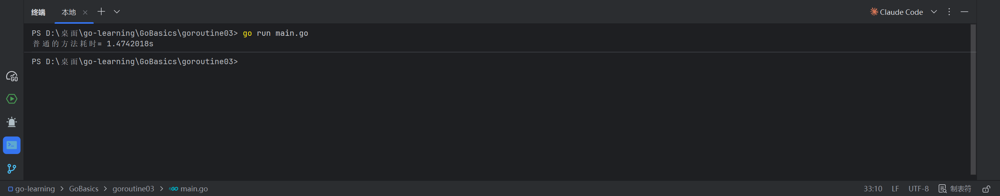
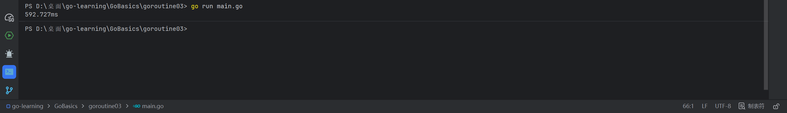

# Go语言关键字

- Go语言中一共有25个关键字

| 1           | 2          | 3              | 4          | 5             | 6           | 7            | 8          |
| ----------- | ---------- | -------------- | ---------- | ------------- | ----------- | ------------ | ---------- |
| ***if***    | ***else*** | ***switch***   | ***case*** | ***default*** | ***break*** | ***return*** | ***goto*** |
| fallthrough | ***for***  | ***continue*** | type       | ***struct***  | var         | ***const***  | map        |
| func        | interface  | range          | import     | package       | defer       | go           | select     |
| chan        |            |                |            |               |             |              |            |

```go
%d          十进制整数
%x, %o, %b  十六进制，八进制，二进制整数。
%f, %g, %e  浮点数： 3.141593 3.141592653589793 3.141593e+00
%t          布尔：true或false
%c          字符（rune） (Unicode码点)
%s          字符串
%q          带双引号的字符串"abc"或带单引号的字符'c'
%v          变量的自然形式（natural format）
%T          变量的类型
%%          字面上的百分号标志（无操作数）
```


# 1.Go语言定义变量

## 1.var定义变量

```go
var 变量名 类型=表达式
```

```go
var name string="zhangsan"
```

## 2.类型推导方式定义变量

a在函数内部，可以使用更简略的:=方式声明并初始化变量。 

**注意：短变量只能用于声明局部变量，不能用于全局变量的声明**

```go
变量名 := 表达式
```

```go
n := 10
```

# 切片

切片（Slice）是一个拥有相同类型元素的可变长度的序列。它是基于数组类型做的一层封装。 它非常灵活，支持自动扩容。 

切片是一个**引用类型**，它的内部结构包含**地址**、**长度**和**容量**。

 声明切片类型的基本语法如下： 

```go
var name []T 
```

其中： 

1. name:表示变量名 
2. T:表示切片中的元素类型

## 关于 nil 的认识

当你声明了一个变量 , 但却还并没有赋值时 , golang 中会自动给你的变量赋值一个默认零
值。这是每种类型对应的零值。

```go
bool -> false
numbers -> 0
string-> "" 
pointers -> nil
slices -> nil
maps -> nil
channels -> nil
functions -> nil
interfaces -> nil
```

## 切片的循环遍历

切片的循环遍历和数组的循环遍历是一样的

```go
var a = []string{"北京", "上海", "深圳"}
// 方法 1：for 循环遍历
for i := 0; i < len(a); i++ {
fmt.Println(a[i])
}
// 方法 2：for range 遍历
for index, value := range a {
fmt.Println(index, value)
}
```

## 基于数组定义切片

由于切片的底层就是一个数组，所以我们可以基于数组定义切片。

```go
func main() {
// 基于数组定义切片
a := [5]int{55, 56, 57, 58, 59}
b := a[1:4] //基于数组 a 创建切片，包括元素 a[1],a[2],a[3]
fmt.Println(b) //[56 57 58]
fmt.Printf("type of b:%T\n", b) //type of b:[]int
}
还支持如下方式：
c := a[1:] //[56 57 58 59]
d := a[:4] //[55 56 57 58]
e := a[:] //[55 56 57 58 59]
```

## 切片再切片

除了基于数组得到切片，我们还可以通过切片来得到切片。

```go
func main() {
//切片再切片
a := [...]string{"北京", "上海", "广州", "深圳", "成都", "重庆"}
fmt.Printf("a:%v type:%T len:%d cap:%d\n", a, a, len(a), cap(a))
b := a[1:3]
fmt.Printf("b:%v type:%T len:%d cap:%d\n", b, b, len(b), cap(b))
c := b[1:5]
fmt.Printf("c:%v type:%T len:%d cap:%d\n", c, c, len(c), cap(c))
}

```

```go
输出：
a:[北京 上海 广州 深圳 成都 重庆] type:[6]string len:6 cap:6
b:[上海 广州] type:[]string len:2 cap:5
c:[广州 深圳 成都 重庆] type:[]string len:4 cap:4
```

**注意： 对切片进行再切片时，索引不能超过原数组的长度，否则会出现索引越界的错误。**

## 关于切片的长度和容量

切片拥有自己的长度和容量，我们可以通过使用内置的 **len()函数**求长度，使用内置的 **cap()函数**求切片的容量。
切片的长度就是它所包含的元素个数。
切片的容量是从它的第一个元素开始数，到其底层数组元素末尾的个数。
切片 s 的长度和容量可通过表达式 len(s) 和 cap(s) 来获取。

```go
s := []int{2, 3, 5, 7, 11, 13}
fmt.Println(s)
fmt.Printf("长度:%v 容量 %v\n", len(s), cap(s))
c := s[:2]
fmt.Println(c)
fmt.Printf("长度:%v 容量 %v\n", len(c), cap(c))
d := s[1:3]
fmt.Println(d)
fmt.Printf("长度:%v 容量 %v", len(d), cap(d))

```

```go
输出：
D:\golang\src\demo01>go run main.go
[2 3 5 7 11 13]
长度:6 容量 6
[2 3]
长度:2 容量 6
[3 5]
长度:2 容量 5
```

# 结构体和 Json 相互转换 序列化反序列化 

## 关于 JSON 数据

JSON(JavaScript Object Notation) 是一种轻量级的数据交换格式。易于人阅读和编写。同时也
易于机器解析和生成。RESTfull Api 接口中返回的数据都是 json 数据。
Json 的基本格式如下：

```go
{
"a": "Hello",
"b": "World"
}
```

稍微复杂点的 JSON

```go
{ 
    "result": [{ 
        "_id": "59f6ef443ce1fb0fb02c7a43", 
        "title": "笔记本电脑",
		"status": "1", 
        "pic": "public\\upload\\UObZahqPYzFvx_C9CQjU8KiX.png", 
        "url": "12"
}, { 
        "_id": "5a012efb93ec4d199c18d1b4", 
        "title": "第二个轮播图", 
        "status": "1", 
        "pic": "public\\upload\\f3OtH11ZaPX5AA4Ov95Q7DEM.png"
}, { 
        "_id": "5a012f2433574208841e0820", 
        "title": "第三个轮播图", 
        "status": "1", 
        "pic": "public\\upload\\s5ujmYBQVRcLuvBHvWFMJHzS.jpg"
}, { 
        "_id": "5a688a0ca6dcba0ff4861a3d", 
        "title": "教程", 
        "status": "1", 
        "pic": "public\\upload\\Zh8EP9HOasV28ynDSp8TaGwd.png"
}]
}
```

## 结构体与 JSON 序列化

比如我们 Golang 要给 App 或者小程序提供 Api 接口数据，这个时候就需要涉及到结构体和Json 之间的相互转换
**Golang JSON 序列化**是指把结构体数据转化成 JSON 格式的字符**Golang JSON 的反序列化**
是指把 JSON 数据转化成 Golang 中的结构体对象

Golang 中 的 序 列 化 和 反 序 列 化 主 要 通 过 `"encoding/json"` 包 中 的 `json.Marshal()` 和`json.Unmarshal()`方法实现

### 1、结构体对象转化成 Json 字符串

```go
package main
import ( "encoding/json"
        "fmt"
       )
type Student struct {
    ID int
    Gender string
    name string //私有属性不能被 json 包访问
    Sno string
}
func main() {
    var s1 = Student{
        ID: 1, Gender: "男", Name: "李四", Sno: "s0001", }
    fmt.Printf("%#v\n", s1)
    var s, _ = json.Marshal(s1)
    jsonStr := string(s)
    fmt.Println(jsonStr)
}
```

### 2、Json 字符串转换成结构体对象

```go
package main
import ( "encoding/json"
        "fmt"
       )
type Student struct {
    ID int
    Gender string
    Name string
    Sno string
}
func main() {
    var jsonStr = "{\"ID\":1,\"Gender\":\"男\",\"Name\":\"李四\",\"Sno\":\"s0001\"}" var jsonStr = `{"ID":1,"Gender":"男","Name":"李四","Sno":"s0001"}` //定义一个 Monster 实例
    var student Student
    err := json.Unmarshal([]byte(jsonStr), &student)
    if err != nil {
        fmt.Printf("unmarshal err=%v\n", err)
    }
    fmt.Printf("反序列化后 student=%#v student.Name=%v \n", student, student.Name)
}
```

## 结构体标签 Tag

Tag 是结构体的元信息，可以在运行的时候通过反射的机制读取出来。 Tag 在结构体字段的后方定义，由一对反引号包裹起来，具体的格式如下：

```go
\`key1:"value1" key2:"value2"\` 
```

结构体 **tag** 由一个或多个键值对组成。键与值使用冒号分隔，值用双引号括起来。同一个结构体字段可以设置多个键值对 **tag**，不同的键值对之间使用空格分隔。
**注意事项： 为结构体编写 Tag 时，必须严格遵守键值对的规则。结构体标签的解析代码的容错能力很差，一旦格式写错，编译和运行时都不会提示任何错误，通过反射也无法正确取值。例如不要在 key 和 value 之间添加空格。**

```go
package main
import ( "encoding/json"
        "fmt"
       )
type Student struct {
    ID int `json:"id"` //通过指定 tag 实现 json 序列化该字段时的 key
    Gender string `json:"gender"` Name string
    Sno string
}
func main() {
    var s1 = Student{
        ID: 1, Gender: "男", Name: "李四", Sno: "s0001", }
    fmt.Printf("%#v\n", s1)
    var s, _ = json.Marshal(s1)
    jsonStr := string(s)
    fmt.Println(jsonStr)
}
```

```go
package main
import ( "encoding/json"
        "fmt"
       )
type Student struct {
    ID int `json:"id"` //通过指定 tag 实现 json 序列化该字段时的 key
    Gender string `json:"gender"` Name string
    Sno string
}
func main() {
    var s2 Student
    var str = "{\"id\":1,\"gender\":\"男\",\"Name\":\"李四\",\"Sno\":\"s0001\"}" err := json.Unmarshal([]byte(str), &s2)
    if err != nil {
        fmt.Println(err)
    }
    fmt.Printf("%#v", s2)
}
```

## 嵌套结构体和 JSON 序列化反序列化

```go
package main
import ( "encoding/json"
        "fmt"
       )
//Student 学生
type Student struct {
    ID int
    Gender string
    Name string
}
//Class 班级
type Class struct {
    Title string
    Students []Student
}
func main() {
    c := &Class{
        Title: "001", Students: make([]Student, 0, 200), }
    for i := 0; i < 10; i++ {
        stu := Student{
            Name: fmt.Sprintf("stu%02d", i), Gender: "男", ID: i, }
        c.Students = append(c.Students, stu)
    }
    //JSON 序列化：结构体-->JSON 格式的字符串
    data, err := json.Marshal(c)
    if err != nil {
        fmt.Println("json marshal failed")
        return
    }
    fmt.Printf("json:%s\n", data)
}
```

```go
package main
import ( "encoding/json"
        "fmt"
       )
//Student 学生
type Student struct {
    ID int
    Gender string
    Name string
}
//Class 班级
type Class struct {
    Title string
    Students []Student
}
func main() {
    str := `{"Title":"001","Students":[{"ID":0,"Gender":" 男 ","Name":"stu00"},{"ID":1,"Gender":" 男 ","Name":"stu01"},{"ID":2,"Gender":" 男 ","Name":"stu02"},{"ID":3,"Gender":" 男
","Name":"stu03"},{"ID":4,"Gender":" 男 ","Name":"stu04"},{"ID":5,"Gender":" 男
","Name":"stu05"},{"ID":6,"Gender":" 男 ","Name":"stu06"},{"ID":7,"Gender":" 男
","Name":"stu07"},{"ID":8,"Gender":" 男 ","Name":"stu08"},{"ID":9,"Gender":" 男
","Name":"stu09"}]}` c1 := &Class{}
    err := json.Unmarshal([]byte(str), c1)
    if err != nil {
        fmt.Println("json unmarshal failed!")
        return
    }
    fmt.Printf("%#v\n", c1)
}
```

# go mod 以及 Golang 包

## 一、包的介绍和定义

包（package）是多个 Go 源码的集合，是一种高级的代码复用方案，Go 语言为我们提供了
很多内置包，如 fmt、strconv、strings、sort、errors、time、encoding/json、os、io 等。
Golang 中的包可以分为三种：1、系统内置包 2、自定义包 3、第三方包
**系统内置包**: Golang 语言给我们提供的内置包，引入后可以直接使用，如 fmt、strconv、strings、
sort、errors、time、encoding/json、os、io 等。
**自定义包**：开发者自己写的包
**第三方包**：属于自定义包的一种，需要下载安装到本地后才可以使用，如前面给大家介绍的
"github.com/shopspring/decimal"包解决 float 精度丢失问题。

## 二、Golang 包管理工具 go mod

在 Golang1.11 版本之前如果我们要自定义包的话必须把项目放在 GOPATH 目录。Go1.11 版
本之后无需手动配置环境变量，使用 go mod 管理项目，也不需要非得把项目放到 GOPATH
指定目录下，你可以在你磁盘的任何位置新建一个项目 , Go1.13 以后可以彻底不要 GOPATH

### 1、go mod init 初始化项目

实际项目开发中我们首先要在我们项目目录中用 go mod 命令生成一个 go.mod 文件管理我
们项目的依赖。
比如我们的 golang 项目文件要放在了 itying 这个文件夹，这个时候我们需要在 itying 文件夹
里面使用 go mod 命令生成一个 go.mod 文件

### 2、go mod 其他命令

| 命令         | 功能                                                         |
| ------------ | ------------------------------------------------------------ |
| **download** | download modules to local cache (下载依赖的 module 到本地 cache)) |
| **edit**     | edit go.mod from tools or scripts (编辑 go.mod 文件)         |
| **graph**    | print module requirement graph (打印模块依赖图))             |
| **init**     | initialize new module in current directory (再当前文件夹下初始化一个新的<br/>module, 创建 go.mod 文件)) |
| **tidy**     | add missing and remove unused modules (增加丢失的 module，去掉未用的<br/>module) |
| **vendor**   | make vendored copy of dependencies (将依赖复制到 vendor 下)  |
| **verify**   | verify dependencies have expected content (校验依赖 检查下载的第三方库有没<br/>有本地修改，如果有修改，则会返回非 0，否则验证成功。) |
| **why**      | explain why packages or modules are needed (解释为什么需要依赖) |

## 三、Golang 中自定义包

包（package）是多个 Go 源码的集合，一个包可以简单理解为一个存放多个.go 文件的文件夹。该文件夹下面的所有 go 文件都要在代码的第一行添加如下代码，声明该文件归属的包。package 包名

注意事项：

- 一个文件夹下面直接包含的文件只能归属一个 package，同样一个 package 的文件不能在多个文件夹下。
- 包名可以不和文件夹的名字一样，包名不能包含 - 符号。
- 包名为 main 的包为应用程序的入口包，这种包编译后会得到一个可执行文件，而编译不包含 main 包的源代码则不会得到可执行文件。

### 1、定义一个包

如果想在一个包中引用另外一个包里的标识符（如变量、常量、类型、函数等）时，该标识符必须是对外可见的（public）。在 Go 语中只需要将标识符的首字母大写就可以让标识符对外可见了。

#### 1、定义一个包名为 calc 的包，代码如下：

```go
package calc
//首字母大小表示公有，首字母小写表示私有
var a = 100 //私有变量
var Age = 20 //公有变量
func Add(x, y int) int {
    return x + y
}
func Sum(x, y int) int {
    return x - y
}
```

#### 2、main.go 中引入这个包

访问一个包里面的公有属性方法的时候需要通过包名称.去访问

```go
package main
import ( "fmt"
        "itying/calc"
       )
func main() {
    c := calc.Add(10, 20)
    fmt.Println(c)
}
```


### 2、导入一个包

**单行导入**
单行导入的格式如下：

```go
import "包 1"
import "包 2"
```

**多行导入**
多行导入的格式如下：

```go
import ( "包 1"
"包 2"
)
```

**匿名导入包**
如果只希望导入包，而不使用包内部的数据时，可以使用匿名导入包。具体的格式如下：

```go
import _ "包的路径" 
```

匿名导入的包与其他方式导入的包一样都会被编译到可执行文件中。
**自定义包名**
在导入包名的时候，我们还可以为导入的包设置别名。通常用于导入的包名太长或者导入的包名冲突的情况。具体语法格式如下：

```go
import 别名 "包的路径" 
```

**单行引入定义别名：**

```go
import c "itying/calc" 
```

**多行引入定义别名：**

```go
import ( 
    "fmt" 
    c "itying/calc"//给calc这个包名起一个别名c
)
```

## 四、Golang 中 init()初始化函数

**init()函数介绍**
在 Go 语言程序执行时导入包语句会自动触发包内部 init()函数的调用。需要注意的是：init()函数没有参数也没有返回值。 init()函数在程序运行时自动被调用执行，不能在代码中主动调用它。
包初始化执行的顺序如下图所示：



**init()函数执行顺序**
Go 语言包会从 main 包开始检查其导入的所有包，每个包中又可能导入了其他的包。Go 编译器由此构建出一个树状的包引用关系，再根据引用顺序决定编译顺序，依次编译这些包的代码。

在运行时，被最后导入的包会最先初始化并调用其 init()函数， 如下图示：



## 五、Golang 中使用第三方包

我们可以在 https://pkg.go.dev/ 查找看常见的 golang 第三方包

### 1、初始化项目

```go
go mod init 项目名
```

### 2、下载安装这个包（非必须）

比如前面给大家演示的解决 float 精度损失的包 decimal
https://github.com/shopspring/decimal
提示：此命令需要 cd 到项目里面执行

```go
go get github.com/shopspring/decimal
```

### 3、看文档使用这个包

包安装完毕后我们就可以看文档使用这个包了，引入包以后可以使用 go mod tidy 增加丢失的 module 去掉未用的 module

### 4、go mod tidy 下载丢失的包

go mod tidy 增加丢失的 module 去掉未用的 module （推荐）

```go
go mod tidy
```

# Golang 中的接口

## 一、接口的介绍

### 1、现实生活中的接口

现实生活中手机、相机、U 盘都可以和电脑的 USB 接口建立连接。我们不需要关注 usb 卡槽
大小是否一样，因为所有的 USB 接口都是按照统一的标准来设计的。

### 2、Golang 中的接口（interface）

Golang 中的接口是一种抽象数据类型，Golang 中接口定义了对象的行为规范，只定义规范不实现。接口中定义的规范由具体的对象来实现。
通俗的讲接口就一个标准，它是对一个对象的行为和规范进行约定，约定实现接口的对象必须得按照接口的规范。

*Go 语言中的接口（Interface）在概念和用途上，最类似于 C++ 中的**纯虚基类（Pure Virtual Base Class）**，也就是**抽象基类（Abstract Base Class）**。*

*当你想在 Go 中使用接口来设计架构时，你可以把它当成 C++ 里**没有数据成员、且不需要显式继承的纯虚基类**来理解。*

## 二、Golang 接口的定义

在 Golang 中接口（interface）是一种类型，一种抽象的类型。接口（interface）是一组函数 method 的集合，Golang 中的接口不能包含任何变量。
在 Golang 中接口中的所有方法都没有方法体，接口定义了一个对象的行为规范，只定义规范不实现。接口体现了程序设计的多态和高内聚低耦合的思想
Golang 中的接口也是一种数据类型，不需要显示实现。只需要一个变量含有接口类型中的所有方法，那么这个变量就实现了这个接口。
Golang 中每个接口由数个方法组成，接口的定义格式如下：

```go
type 接口名 interface{
    方法名 1( 参数列表 1 ) 返回值列表 1
    方法名 2( 参数列表 2 ) 返回值列表 2 …
}
```

其中：

- 接口名：使用 type 将接口定义为自定义的类型名。Go 语言的接口在命名时，一般会在单词后面添加 er，如有写操作的接口叫 Writer，有字符串功能的接口叫 Stringer 等。接口名最好要能突出该接口的类型含义。
- 方法名：当方法名首字母是大写且这个接口类型名首字母也是大写时，这个方法可以被接口所在的包（package）之外的代码访问。
- 参数列表、返回值列表：参数列表和返回值列表中的参数变量名可以省略。

演示：定义一个 Usber 接口让 Phone 和 Camera 结构体实现这个接口

```go
package main
import "fmt"
type Usber interface {
    Start()
    Stop()
}
type Phone struct {
    Name string
}
func (p Phone) Start() {
    fmt.Println(p.Name, "开始工作")
}
func (p Phone) Stop() {
    fmt.Println("phone 停止")
}
type Camera struct {
}
func (c Camera) Start() {
    fmt.Println("相机 开始工作")
}
func (c Camera) Stop() {
    fmt.Println("相机 停止工作")
}
func main() {
    phone := Phone{
        Name: "小米手机", }
    var p Usber = phone //phone 实现了 Usb 接口
    p.Start()
    camera := Camera{}
    var c Usber = camera //camera 实现了 Usb 接口
    c.Start()
}
```

演示：Computer 结构体中的 Work 方法必须传入一个 Usb 的接口

```go
package main
import "fmt"
type Usber interface {
    Start()
    Stop()
}
type Phone struct {
    Name string
}
func (p Phone) Start() {
    fmt.Println(p.Name, "开始工作")
}
func (p Phone) Stop() {
    fmt.Println("phone 停止")
}
type Camera struct {
}
func (c Camera) Start() {
    fmt.Println("相机 开始工作")
}
func (c Camera) Stop() {
    fmt.Println("相机 停止工作")
}
//电脑的结构体
type Computer struct {
    Name string
}
// 电脑的 Work 方法要求必须传入 Usb 接口类型数据
func (c Computer) Work(usb Usber) {
    usb.Start()
    usb.Stop()
}
func main() {
    phone := Phone{
        Name: "小米手机", }
    camera := Camera{}
    computer := Computer{}
    //把手机插入电脑的 Usb 接口开始工作
    computer.Work(phone)
    //把相机插入电脑的 Usb 接口开始工作
    computer.Work(camera)
}
```

## 三、空接口

Golang 中的接口可以不定义任何方法，没有定义任何方法的接口就是空接口。空接口表示没有任何约束，因此任何类型变量都可以实现空接口。
空接口在实际项目中用的是非常多的，用空接口可以表示任意数据类型。
案例：

```go
func main() {
    // 定义一个空接口 x, x 变量可以接收任意的数据类型
    var x interface{}
    s := "你好 golang" x = s
    fmt.Printf("type:%T value:%v\n", x, x)
    i := 100
    x = i
    fmt.Printf("type:%T value:%v\n", x, x)
    b := true
    x = b
    fmt.Printf("type:%T value:%v\n", x, x)
}
```

### 1、空接口作为函数的参数

使用空接口实现可以接收任意类型的函数参数。

```go
// 空接口作为函数参数
func show(a interface{}) {
    fmt.Printf("type:%T value:%v\n", a, a)
}
```

### 2、map 的值实现空接口

使用空接口实现可以保存任意值的字典。

```go
// 空接口作为 map 值
var studentInfo = make(map[string]interface{})
studentInfo["name"] = "张三"
studentInfo["age"] = 18
studentInfo["married"] = false
fmt.Println(studentInfo)
```

### 3、切片实现空接口

```go
var slice = []interface{}{"张三", 20, true, 32.2}
fmt.Println(slice)
```

## 四、类型断言

一个接口的值（简称接口值）是由一个具体类型和具体类型的值两部分组成的。这两部分分别称为接口的动态类型和动态值。

如果我们想要判断空接口中值的类型，那么这个时候就可以使用类型断言，其语法格式：

```go
x.(T)
```

其中：

- x : 表示类型为 interface{}的变量
- T : 表示断言 x 可能是的类型。

该语法返回两个参数，第一个参数是 x 转化为 T 类型后的变量，第二个值是一个布尔值，若为 true 则表示断言成功，为 false 则表示断言失败。
举个例子：

```go
func main() {
    var x interface{}
    x = "Hello golnag" 
    v, ok := x.(string)
    if ok {
        fmt.Println(v)
    } else {
        fmt.Println("类型断言失败")
    }
}
```

上面的示例中如果要断言多次就需要写多个 if 判断，这个时候我们可以使用 switch 语句来
实现：
**注意：类型.(type)只能结合 switch 语句使用**

```go
func justifyType(x interface{}) {
    switch v := x.(type) {
        case string:
        fmt.Printf("x is a string，value is %v\n", v)
        case int:
        fmt.Printf("x is a int is %v\n", v)
        case bool:
        fmt.Printf("x is a bool is %v\n", v)
        default:
        fmt.Println("unsupport type！")
    }
}
```

因为空接口可以存储任意类型值的特点，所以空接口在 Go 语言中的使用十分广泛。

**关于接口需要注意的是**：只有当有两个或两个以上的具体类型必须以相同的方式进行处理时
才需要定义接口。不要为了接口而写接口，那样只会增加不必要的抽象，导致不必要的运行
时损耗。

## 五、结构体值接收者和指针接收者实现接口的区别

值接收者：
如果结构体中的方法是值接收者，那么实例化后的结构体值类型和结构体指针类型都可以赋值给接口变量

```go
package main
import "fmt"
type Usb interface {
    Start()
    Stop()
}
type Phone struct {
    Name string
}
func (p Phone) Start() {
    fmt.Println(p.Name, "开始工作")
}
func (p Phone) Stop() {
    fmt.Println("phone 停止")
}
func main() {
    phone1 := Phone{
        Name: "小米手机", }
    var p1 Usb = phone1 //phone1 实现了 Usb 接口 phone1 是 Phone 类型
    p1.Start() //小米手机 开始工作
    phone2 := &Phone{
        Name: "苹果手机", }
    var p2 Usb = phone2 //phone2 实现了 Usb 接口 phone2 是 *Phone 类型
    p2.Start() //苹果手机 开始工作
}
```

指针接收者：
如果结构体中的方法是指针接收者，那么实例化后结构体指针类型都可以赋值给接口变量，结构体值类型没法赋值给接口变量。

```go
package main
import "fmt"
type Usb interface {
    Start()
    Stop()
}
type Phone struct {
    Name string
}
func (p *Phone) Start() {
    fmt.Println(p.Name, "开始工作")
}
func (p *Phone) Stop() {
    fmt.Println("phone 停止")
}
func main() {
    /* 错误写法
phone1 := Phone{
Name: "小米手机", }
var p1 Usb = phone1
p1.Start() */
    //正确写法
    phone2 := &Phone{
        Name: "苹果手机", }
    var p2 Usb = phone2 //phone2 实现了 Usb 接口 phone2 是 *Phone 类型
    p2.Start() //苹果手机 开始工作
}
```

### **各自的作用与适用场景**

#### **值接收者的作用：**

1. **不可变数据（只读操作）**：当你不需要在方法内部修改结构体的字段时，使用值接收者。这保证了调用方法时，原始数据绝对不会被意外篡改。
2. **轻量级结构体**：如果结构体非常小（例如只有几个 `int` 或 `bool` 字段），值拷贝的开销极低，使用值接收者可以避免指针间接寻址带来的微小性能损耗。
3. **并发安全**：因为每次调用都是数据的副本，天然避免了多个协程同时调用该方法时产生的数据竞争问题。

#### **指针接收者的作用：**

1. **修改内部状态**：这是最常见的作用。当你需要在方法内部修改结构体的字段时（例如 `SetAge()`、`AddItem()`），必须使用指针接收者，否则修改的只是副本，原对象不会发生变化。
2. **避免大对象拷贝**：如果结构体包含大型切片、Map 或长字符串，值拷贝会导致显著的内存分配和性能下降。使用指针接收者只传递 8 字节的内存地址，极其高效。
3. **保持单例/状态一致性**：在实现并发控制（如配合 `sync.Mutex` 使用）时，必须使用指针接收者，以确保所有操作都作用于同一个锁和同一份数据上。

### **💡 最佳实践建议**

在实际开发中，Go 官方社区有一个不成文的共识：

- 如果不确定用哪个，或者结构体稍大，**默认优先使用指针接收者**。
- 只有当你明确知道该方法不需要修改数据，且结构体非常小（如 `time.Time`、坐标点 `Point`）时，才使用值接收者。
- **保持一致性**：同一个结构体，尽量要么全用值接收者，要么全用指针接收者，不要混用，以免让调用者感到困惑。

## 六、一个结构体实现多个接口

Golang 中一个结构体也可以实现多个接口

```go
package main
import "fmt"
type AInterface interface {
    GetInfo() string
}
type BInterface interface {
    SetInfo(string, int)
}
type People struct {
    Name string
    Age int
}
func (p People) GetInfo() string {
    return fmt.Sprintf("姓名:%v 年龄:%d", p.Name, p.Age)
}
func (p *People) SetInfo(name string, age int) {
    p.Name = name
    p.Age = age
}
func main() {
    var people = &People{
        Name: "张三", 
        Age: 20, 
    }
    // people 实现了 AInterface 和 BInterface
    var p1 AInterface = people
    var p2 BInterface = people
    
    fmt.Println(p1.GetInfo())
    p2.SetInfo("李四", 30)
    fmt.Println(p1.GetInfo())
}
```

## 七、接口嵌套

接口与接口间可以通过嵌套创造出新的接口。

```go
package main
import "fmt"
type SayInterface interface {
    say()
}
type MoveInterface interface {
    move()
}
// 接口嵌套
type Animal interface {
    SayInterface
    MoveInterface
}
type Cat struct {
    name string
}
func (c Cat) say() {
    fmt.Println("喵喵喵")
}
func (c Cat) move() {
    fmt.Println("猫会动")
}
func main() {
    var x Animal
    x = Cat{name: "花花"}
    x.move()
    x.say()
}
```

## map[string]interface{} 无法直接访问内部数据的解决方案

在 Go 语言中，当你将切片或结构体存入 `map[string]interface{}` 后，取出的值类型是 `interface{}`。由于 `interface{}` 本身不支持索引操作（如 `[0]`）或点号语法（如 `.Name`），因此无法直接访问其内部的具体值。

要解决这个问题，核心思路是进行**类型断言（Type Assertion）**，将 `interface{}` “还原”为具体的切片或结构体类型。以下是针对切片和结构体的具体解决方案：

### **1. 解决切片不能按索引访问的问题**

当你从 map 中取出一个切片时，必须先将其断言为对应的切片类型（例如 `[]string` 或 `[]interface{}`），然后才能使用 `[0]` 这样的索引操作。

**示例代码：**

```go
// 假设 map 中存了一个字符串切片
data := map[string]interface{}{
    "tags": []string{"Go", "Backend"},
}

// ❌ 错误写法：直接索引会导致编译错误 (invalid operation)
// tag := data["tags"][0] 

// ✅ 正确写法：先进行类型断言
if tags, ok := data["tags"].([]string); ok {
    fmt.Println("第一个标签:", tags[0]) // 输出: Go
}
```

### **2. 解决结构体不能按字段访问的问题**

当你从 map 中取出一个结构体时，必须将其断言为该结构体的具体类型，之后才能使用点号（`.`）访问其字段。

**示例代码：**

go


```go
type User struct {
    Name string
    Age  int
}

// 假设 map 中存了一个 User 结构体
data := map[string]interface{}{
    "user": User{Name: "张三", Age: 25},
}

// ❌ 错误写法：直接访问字段会导致编译错误
// name := data["user"].Name 

// ✅ 正确写法：先进行类型断言
if user, ok := data["user"].(User); ok {
    fmt.Println("姓名:", user.Name) // 输出: 张三
}
```

# Golang goroutine channel 实现并发和并行

## 一、为什么要使用 goroutine

需求：要统计 1-10000000 的数字中那些是素数，并打印这些素数？
素数：就是除了 1 和它本身不能被其他数整除的数
实现方法：
1、传统方法，通过一个 for 循环判断各个数是不是素数
2、使用并发或者并行的方式，将统计素数的任务分配给多个 goroutine 去完成，这个时候就用到了 goroutine
3、goroutine 结合 channel

## 二、进程、线程以及并行、并发

### 1、关于进程和线程

**进程（Process）**就是程序在操作系统中的一次执行过程，是系统进行资源分配和调度的基本单位，进程是一个动态概念，是程序在执行过程中分配和管理资源的基本单位，每一个进程都有一个自己的地址空间。一个进程至少有 5 种基本状态，它们是：初始态，执行态，等待状态，就绪状态，终止状态。

通俗的讲进程就是一个正在执行的程序。

**线程** 是进程的一个执行实例，是程序执行的最小单元，它是比进程更小的能独立运行的基本单位

一个进程可以创建多个线程，同一个进程中的多个线程可以并发执行，一个程序要运行的话至少有一个进程。





### 2、关于并行和并发

**并发：**多个线程同时竞争一个位置，竞争到的才可以执行，每一个时间段只有一个线程在执行。

**并行：**多个线程可以同时执行，每一个时间段，可以有多个线程同时执行。

**通俗的讲**多线程程序在单核 CPU 上面运行就是**并发**，多线程程序在多核 CPU上运行就是**并行**，如果线程数大于 CPU 核数，则多线程程序在多个 CPU 上面运行既有并行又有并发





## 三、Golang 中的协程（goroutine）以及主线程

**golang 中的主线程：**（可以理解为线程/也可以理解为进程），在一个 Golang 程序的主线程上可以起**多个协程**。**Golang 中多协程**可以实现并行或者并发。

**协程：**可以理解为用户级线程，这是对内核透明的，也就是系统并不知道有协程的存在，是完全由用户自己的程序进行调度的。Golang 的一大特色就是从语言层面原生支持协程，在函数或者方法前面加 go 关键字就可创建一个协程。可以说 Golang 中的协程就是goroutine 。



Golang 中的多**协程**有点类似其他语言中的多线程。

**多协程和多线程：**Golang 中每个 goroutine (协程) 默认占用内存远比 Java 、C 的线程少。OS 线程（操作系统线程）一般都有固定的栈内存（通常为 2MB 左右）,一个 goroutine (协程) 占用内存非常小，只有 2KB 左右，多协程 goroutine 切换调度开销方面远比线程要少。
这也是为什么越来越多的大公司使用 Golang 的原因之一

## 四、Goroutine 的使用以及 sync.WaitGroup

**并行执行需求：**
在主线程(可以理解成进程)中，开启一个 goroutine, 该协程每隔 50 毫秒秒输出 "你好 golang" 在主线程中也每隔 50 毫秒输出"你好 golang", 输出 10 次后，退出程序，要求主线程和goroutine 同时执行。

```go
package main
import ( "fmt"
        "strconv"
        "time"
       )
func test() {
    for i := 1; i <= 10; i++ {
        fmt.Println("tesst () hello,world " + strconv.Itoa(i))
        time.Sleep(time.Second)
    }
}
func main() {
    go test() // 开启了一个协程
    for i := 1; i <= 10; i++ {
        fmt.Println(" main() hello,golang" + strconv.Itoa(i))
        time.Sleep(time.Second)
    }
}
```

上面代码看上去没有问题，但是要注意主线程执行完毕后即使协程没有执行完毕，程序也会退出，所以我们需要对上面代码进行改造。



sync.WaitGroup 可以实现主线程等待协程执行完毕。

```go
package main
import ( "fmt"
        "strconv"
        "sync"
        "time"
       )
var wg sync.WaitGroup //1、定义全局的 WaitGroup
func test() {
    for i := 1; i <= 10; i++ {
        fmt.Println("test () 你好 golang " + strconv.Itoa(i))
        time.Sleep(time.Millisecond * 50)
    }
    wg.Done() // 4、goroutine 结束就登记-1
}
func main() {
    wg.Add(1) //2、启动一个 goroutine 就登记+1
    go test()
    for i := 1; i <= 2; i++ {
        fmt.Println(" main() 你好 golang" + strconv.Itoa(i))
        time.Sleep(time.Millisecond * 50)
    }
    wg.Wait() // 3、等待所有登记的 goroutine 都结束
}
```

## 五、启动多个 Goroutine

在 Go 语言中实现并发就是这样简单，我们还可以启动多个 goroutine。让我们再来一个例子：
（这里使用了 sync.WaitGroup 来实现等待 goroutine 执行完毕）

```go
var wg sync.WaitGroup
func hello(i int) {
    defer wg.Done() // goroutine 结束就登记-1
    fmt.Println("Hello Goroutine!", i)
}
func main() {
    for i := 0; i < 10; i++ {
        wg.Add(1) // 启动一个 goroutine 就登记+1
        go hello(i)
    }
    wg.Wait() // 等待所有登记的 goroutine 都结束
}
```

多次执行上面的代码，会发现每次打印的数字的顺序都不一致。这是因为 10 个 goroutine是并发执行的，而 goroutine 的调度是随机的。

## 六、设置 Golang 并行运行的时候占用的 cup 数量

Go 运行时的调度器使用 GOMAXPROCS 参数来确定需要使用多少个 OS 线程来同时执行 Go代码。默认值是机器上的 CPU 核心数。例如在一个 8 核心的机器上，调度器会把 Go 代码同时调度到 8 个 OS 线程上。

Go 语言中可以通过 runtime.GOMAXPROCS()函数设置当前程序并发时占用的 CPU 逻辑核心数。

Go1.5 版本之前，默认使用的是单核心执行。Go1.5 版本之后，默认使用全部的 CPU 逻辑核心数。

```go
package main
import ( "fmt"
        "runtime"
       )
func main() {
    //获取当前计算机上面的 Cup 个数
    cpuNum := runtime.NumCPU()
    fmt.Println("cpuNum=", cpuNum)
    //可以自己设置使用多个 cpu
    runtime.GOMAXPROCS(cpuNum - 1)
    fmt.Println("ok")
}
```

## 七、Goroutine 统计素数

需求：要统计 1-120000 的数字中那些是素数？

### 1、通过传统的 for 循环来统计

```go
func main() {
	start := time.Now()
	for num := 1; num <= 120000; num++ {
		flag := true //假设是素数
		for i := 2; i < num; i++ {
			if num%i == 0 { //说明该 num 不是素数
				flag = false
				break
			}
		}
		if flag {
			// fmt.Println(num)
		}
	}
	end := time.Now().Sub(start)
	fmt.Println("普通的方法耗时=", end)
}
```



### 2、goroutine 开启多个协程统计

```go
package main

import (
    "fmt"
    "sync"
    "time"
)

//需求：要统计 1-120000 的数字中那些是素数？
/*
1协程统计 1-30000
2 协程统计30001-60000
3协程统计60001-90000
4协程统计90001-120000
*/

var wg sync.WaitGroup

func test(n int) {
    defer wg.Done()
    for num := (n-1)*30000 + 1; num < n*30000; num++ {
        if num > 1 {
            var flag = true
            for i := 2; i < num; i++ {
                if num%i == 0 {
                    flag = false
                    break
                }
            }
            if flag {
                //fmt.Println(num, "是素数")
            }
        }

    }
}

func main() {
    start := time.Now()
    for i := 1; i <= 4; i++ {
        wg.Add(1)
        go test(i)
    }
    wg.Wait()
    end := time.Now().Sub(start)
    fmt.Println(end)
}

```



问题：上面我们使用了 goroutine 已经能大大的提升新能了，但是如果我们想统计数据和打印数据同时进行，这个时候如何实现呢，这个时候我们就可以使用管道。

## 八、Channel 管道

管道是 Golang 在语言级别上提供的 goroutine 间的通讯方式，我们可以使用 channel 在多个 goroutine 之间传递消息。如果说 goroutine 是 Go 程序并发的执行体，channel 就是它们之间的连接。channel 是可以让一个 goroutine 发送特定值到另一个 goroutine 的通信机制。

Golang 的并发模型是 CSP（Communicating Sequential Processes），提倡**通过通信共享内存**而不是**通过共享内存而实现通信。**

Go 语言中的管道（channel）是一种特殊的类型。管道像一个传送带或者队列，总是遵循**先入先出（First In First Out）**的规则，保证收发数据的顺序。每一个管道都是一个具体类型的导管，也就是声明 channel 的时候需要为其指定元素类型。

### 1、channel 类型

channel 是一种类型，一种引用类型。声明管道类型的格式如下：

```go
var 变量 chan 元素类型
举几个例子：
var ch1 chan int // 声明一个传递整型的管道
var ch2 chan bool // 声明一个传递布尔型的管道
var ch3 chan []int // 声明一个传递 int 切片的管道
```

### 2、创建 channel

声明的管道后需要使用 make 函数初始化之后才能使用。
**创建 channel 的格式如下：**

```go
make(chan 元素类型, 容量)
```

举几个例子：

```go
//创建一个能存储 10 个 int 类型数据的管道
ch1 := make(chan int, 10)
//创建一个能存储 4 个 bool 类型数据的管道
ch2 := make(chan bool, 4)
//创建一个能存储 3 个[]int 切片类型数据的管道
ch3 := make(chan []int, 3)
```

### 3、channel 操作

管道有发送（send）、接收(receive）和关闭（close）三种操作。
发送和接收都使用<-符号。
现在我们先使用以下语句定义一个管道：

```go
ch := make(chan int, 3)
```

#### 1、发送（将数据放在管道内）

将一个值发送到管道中。

```go
ch <- 10 // 把 10 发送到 ch 中
```

#### 2、接收（从管道内取值）

从一个管道中接收值。

```go
x := <- ch // 从 ch 中接收值并赋值给变量 x
<-ch // 从 ch 中接收值，忽略结果
```

#### 3、关闭管道

我们通过调用内置的 close 函数来关闭管道。

```go
close(ch)
```

关于关闭管道需要注意的事情是，只有在通知接收方 goroutine 所有的数据都发送完毕的时候才需要关闭管道。管道是可以被垃圾回收机制回收的，它和关闭文件是不一样的，在结束操作之后关闭文件是必须要做的，但关闭管道不是必须的。

**关闭后的管道有以下特点：**

1. 对一个关闭的管道再发送值就会导致 panic。
2. 对一个关闭的管道进行接收会一直获取值直到管道为空。
3. 对一个关闭的并且没有值的管道执行接收操作会得到对应类型的零值。
4. 关闭一个已经关闭的管道会导致 panic。

### 4、管道阻塞

#### 1、无缓冲的管道：

如果创建管道的时候没有指定容量，那么我们可以叫这个管道为无缓冲的管道
无缓冲的管道又称为阻塞的管道。我们来看一下下面的代码：

```go
func main() {
    ch := make(chan int)
    ch <- 10
    fmt.Println("发送成功")
}
```

上面这段代码能够通过编译，但是执行的时候会出现以下错误：

```go
fatal error: all goroutines are asleep - deadlock!
goroutine 1 [chan send]:
main.main()
D:/go_demo/demo21/07goroutine/main.go:10 +0x5b
exit status 2
```

#### 2、有缓冲的管道：

解决上面问题的方法还有一种就是使用有缓冲区的管道。我们可以在使用 make 函数初始化
管道的时候为其指定管道的容量，例如：

```go
func main() {
    ch := make(chan int, 1) // 创建一个容量为 1 的有缓冲区管道
    ch <- 10
    fmt.Println("发送成功")
}
```

只要管道的容量大于零，那么该管道就是有缓冲的管道，管道的容量表示管道中能存放元素的数量。就像你小区的快递柜只有那么个多格子，格子满了就装不下了，就阻塞了，等到别人取走一个快递员就能往里面放一个。

**管道阻塞具体代码如下：**

```go
func main() {
    ch := make(chan int, 1)
    ch <- 10
    ch <- 12
    fmt.Println("发送成功")
}
```

**解决办法：**

```go
func main() {
    ch := make(chan int, 1)
    ch <- 10 //放进去
    <-ch //取走
    ch <- 12 //放进去
    <-ch //取走
    ch <- 17 //还可以放进去
    fmt.Println("发送成功")
}
```

### 5、for range 从管道循环取值

当向管道中发送完数据时，我们可以通过 close 函数来关闭管道。

当管道被关闭时，再往该管道发送值会引发 panic，从该管道取值的操作会先取完管道中的值，再然后取到的值一直都是对应类型的零值。那如何判断一个管道是否被关闭了呢？

我们来看下面这个例子：

```go
package main
import "fmt"
//循环遍历管道数据
func main() {
    var ch1 = make(chan int, 5)
    for i := 0; i < 5; i++ {
        ch1 <- i + 1
    }
    close(ch1) //关闭管道
    //使用 for range 遍历管道，当管道被关闭的时候就会退出 for range,如果没有关闭管道
    就会报个错误 fatal error: all goroutines are asleep - deadlock!
    //通过 for range 来遍历管道数据 管道没有 key
    for val := range ch1 {
        fmt.Println(val)
    }
}
```

从上面的例子中我们看到有两种方式在接收值的时候判断该管道是否被关闭，不过我们通常使用的是 for range 的方式。使用 for range 遍历管道，当管道被关闭的时候就会退出 for range。
