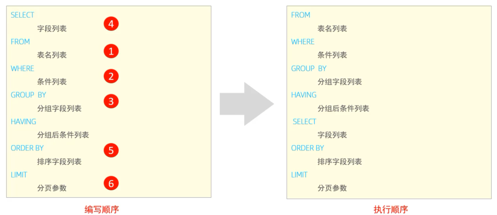

# MySQL

## SQL

### DDL

#### DDL-数据库操作

##### 客户端连接

mysql [-h 127.0.0.1] [-P 3306] -u root -p

##### 查询所有数据

show databases;

##### 创建数据库

create database [if not exists] 数据库名 [default charset 字符集] [排序规则];

##### 删除数据库

drop database [if exists] 数据库名;

##### 使用数据库

use 数据库名;

##### 查询当前使用的数据库

select database();

#### DDL-表操作-查询

##### 查询当前数据库所有表

show tabales;

##### 查询表结构

decs 表名;

##### 查询指定表的建表语句

show create table 表名;

#### DDL-表操作-创建

create 表名(

​	字段1 字段1类型[comment 字段1注释],

​	.......

​	字段n 字段n类型[comment 字段n注释]

)[comment 表注释];

#### DDL-表操作-数据类型

##### 数值类型

| 类型        | 大小   | 有符号 (SIGNED) 范围                                  | 无符号 (UNSIGNED) 范围                                    | 描述                |
| ----------- | ------ | ----------------------------------------------------- | --------------------------------------------------------- | ------------------- |
| tinyint     | 1byte  | (-128, 127)                                           | (0, 255)                                                  | 小整数值            |
| smallint    | 2bytes | (-32768, 32767)                                       | (0, 65535)                                                | 大整数值            |
| mediumint   | 3bytes | (-8388608, 8388607)                                   | (0, 16777215)                                             | 大整数值            |
| int/integer | 4bytes | (-2147483648, 2147483647)                             | (0, 4294967295)                                           | 大整数值            |
| bigint      | 8bytes | (-2^63, 2^63-1)                                       | (0, 2^64-1)                                               | 极大整数值          |
| float       | 4bytes | (-3.402823466 E+38, 3.402823466351 E+38)              | 0 和 (1.175494351 E-38, 3.402823466 E+38)                 | 单精度浮点数值      |
| double      | 8bytes | (-1.7976931348623157 E+308, 1.7976931348623157 E+308) | 0 和 (2.2250738585072014 E-308, 1.7976931348623157 E+308) | 双精度浮点数值      |
| decimal     |        | 依赖于 M (精度) 和 D (标度) 的值                      | 依赖于 M (精度) 和 D (标度) 的值                          | 小数值 (精确定点数) |

##### 字符串类型

| 类型       | 大小                  | 描述                          |
| ---------- | --------------------- | ----------------------------- |
| char       | 0-255 bytes           | 定长字符串 (需要指定长度)     |
| varchar    | 0-65535 bytes         | 变长字符串 (需要指定长度)     |
| tinyblob   | 0-255 bytes           | 不超过 255 个字符的二进制数据 |
| tinytext   | 0-255 bytes           | 短文本字符串                  |
| blob       | 0-65 535 bytes        | 二进制形式的长文本数据        |
| text       | 0-65 535 bytes        | 长文本数据                    |
| mediumblob | 0-16 777 215 bytes    | 二进制形式的中等长度文本数据  |
| mediumtext | 0-16 777 215 bytes    | 中等长度文本数据              |
| longblob   | 0-4 294 967 295 bytes | 二进制形式的极大文本数据      |
| longtext   | 0-4 294 967 295 bytes | 极大文本数据                  |

##### 日期时间类型

| 类型      | 大小 | 范围                                       | 格式                | 描述                     |
| --------- | ---- | ------------------------------------------ | ------------------- | ------------------------ |
| date      | 3    | 1000-01-01 至 9999-12-31                   | YYYY-MM-DD          | 日期值                   |
| time      | 3    | -838:59:59 至 838:59:59                    | HH:MM:SS            | 时间值或持续时间         |
| year      | 1    | 1901 至 2155                               | YYYY                | 年份值                   |
| datetime  | 8    | 1000-01-01 00:00:00 至 9999-12-31 23:59:59 | YYYY-MM-DD HH:MM:SS | 混合日期和时间值         |
| timestamp | 4    | 1970-01-01 00:00:01 至 2038-01-19 03:14:07 | YYYY-MM-DD HH:MM:SS | 混合日期和时间值，时间戳 |

#### DDL-表操作-修改

##### 添加字段

alter table 表名 add 字段名 类型(长度) [comment 注释] [约束];

##### 修改数据类型

alter table 表名 modify 字段名 新数据类型(长度);

##### 修改字段名和数据类型

alter table 表名 change 旧字段名 新字段名 类型(长度) [comment 注释] [约束];

##### 删除字段

alter table 表名 字段名;

##### 修改表名

alter table 表名 rename to 新表名;

##### 删除表

drop table [if exists] 表名;

##### 删除指定表,并重新创建该表

truncate table 表名;

### DML

DML英文全称是Data Manipulation Language(数据操作语言)，用来对数据库中表的数据记录进行增删改操作。

#### DML-添加数据

##### 给指定字段添加数据

insert into 表名(字段1，字段2，....) valuse(值1，值2，....); 

##### 给全部字段添加数据

insert into 表名 valuse(值1，值2，....);

##### 批量添加数据

insert into 表名(字段1，字段2，....) valuse(值1，值2，....),(值1，值2，....),(值1，值2，....);

insert into 表名 valuse(值1，值2，....),(值1，值2，....),(值1，值2，....);

**注意:**
**插入数据时，指定的字段顺序需要与值的顺序是一一对应的。**
**字符串和日期型数据应该包含在引号中。**
**插入的数据大小，应该在字段的规定范围内**

##### DML-修改数据

update 表名 set 字段名1=值1,字段名2=值2,....[where 条件];

**不加where即为修改表中所有的数据**

##### DML-删除数据

delete from 表名 [where 条件];

**注意:**
**DELETE语句的条件可以有，也可以没有，如果没有条件，则会删除整张表的所有数据。**
**DELETE语句不能删除某一个字段的值(可以使用UPDATE)。**

### DQL

DQL英文全称是Data Query Language(数据查询语言)，数据查询语言，用来查询数据库中表的记录。

**查询关键字:SELECT**

#### DQL-语法

select

​		字段列表

from 

​		表名列表

where

​		条件列表

group by

​		分组字段列表

having

​		分组后条件列表

order by

​		排序字段列表

limt

​		分页参数

#### DQL-基本查询

##### 查询多个字段

select 字段1,字段2,字段3... from 表名;

select * from 表名;

**注意:在不同的项目组中有不同的开发规范，尽量不要使用***

##### 设置别名

select 字段1 [as 别名1],字段2 [as 别名2]... from 表名;

**as可以省略**

##### 去除重复记录

select distinct 字段列表 from 表名;

#### DQL-条件查询

##### 语法

select 字段列表 from 表名 where 条件列表;

##### 条件

| 比较运算符          | 功能                                           |
| ------------------- | ---------------------------------------------- |
| >                   | 大于                                           |
| >=                  | 大于等于                                       |
| <                   | 小于                                           |
| <=                  | 小于等于                                       |
| =                   | 等于                                           |
| <> 或！=            | 不等于                                         |
| between ... and ... | 在某个范围之内（包含最小值、最大值）           |
| in(...)             | 在 in 之后的列表取值中多选一                   |
| like 占位符         | 模糊匹配（`_`匹配单个字符，`%`匹配任意个字符） |
| is null             | 判断值为 NULL                                  |

1. **`=` 与 `is null` 区别**：不能用 `= null` 判断空值，`null` 代表未知值，必须使用 `is null` / `is not null`。
2. **LIKE 通配符**

- `_`：仅匹配**单个**任意字符
- `%`：匹配**0 个及以上**任意字符

1. **between 语法**：`列 between 下限 and 上限`，等价于 `列 >= 下限 and 列 <= 上限`。

| 逻辑运算符 | 功能                         |
| ---------- | ---------------------------- |
| and 或 &&  | 并且（多个条件同时成立）     |
| or 或 \|\| | 或者（多个条件任意一个成立） |
| not 或！   | 非，不是                     |

优先级从高到低：**not > and > or**

书写多条件查询建议用括号 `()` 包裹分组，避免优先级歧义。

#### DQL-聚合函数

##### 介绍

将一列数据作为一个整体，进行纵向计算。

##### 常见聚合函数

| 函数  | 功能                     |
| ----- | ------------------------ |
| count | 统计查询结果的记录数量   |
| max   | 求取指定列数据的最大值   |
| min   | 求取指定列数据的最小值   |
| avg   | 计算指定列数据的平均值   |
| sum   | 对指定列所有数据进行求和 |

**补充要点**

1. **count(\*)**：统计所有行，包含值为`NULL`的行；
2. **count (列名)**：只统计该列不为`NULL`的行；
3. `sum`、`avg`会自动忽略字段中`NULL`的数据。 
4. `null`值不参与所有聚合函数的运算

##### 语法

select 聚合函数(字段列表) from 表名;

#### DQL-分组查询

##### 语法

select 字段列表 from 表名 [where 条件] group by 分组字段名 [having 分组后过滤条件];

##### where与having区别

**1.执行时机不同:where是分组之前进行过滤，不满足where条件，不参与分组;而having是分组之后对结果进行过滤。**
**2.判断条件不同:where不能对聚合函数进行判断，而having可以。**

**注意**
**执行顺序:where >聚合函数>having**
**分组之后，查询的字段一般为聚合函数和分组字段，查询其他字段无任何意义。**

#### DQL-排序查询

##### 语法

select 字段列表 from 表名 order by 字段1 排序方式1 , 字段2 排序方式2;

##### 排序方式

ASC:升序(默认值)

DESC:降序

**注意:如果是多字段排序，当第一个字段值相同时，才会根据第二个字段进行排序。**

#### DQL-分页查询

##### 语法 

select 字段列表 from 表名 limit 起始索引,查询记录数;

注意

- 起始索引从0开始，起始索引=(查询页码-1)*每页显示记录数。
- 分页查询是数据库的方言，不同的数据库有不同的实现，MySQL中是LIMIT。
- 如果查询的是第一页数据，起始索引可以省略，直接简写为limit10。

#### DQL-执行顺序



### DCL

DCL英文全称是Data ControlLanguage(数据控制语言)，用来管理数据库用户、控制数据库的访问权限。

#### DCL-管理用户

##### 查询用户

use mysql;

select * from user;

##### 创建用户

create user '用户名'@'主机名' identified by '密码';

##### 修改用户密码

alter user '用户名'@'主机名' identified with mysql_native_password by '新密码';

##### 删除用户

drop user '用户名'@'主机名';

**注意:**

- **主机名可以使用%通配。**
- **这类sQL开发人员操作的比较少，主要是DBA(Database Administrator 数据库管理员)使用。**

#### DCL-权限控制

##### 常用权限

| 权限                | 说明                                       |
| ------------------- | ------------------------------------------ |
| all, all privileges | 授予用户全部操作权限                       |
| select              | 查询数据表中的数据                         |
| insert              | 向数据表插入新数据                         |
| update              | 修改数据表中已存在的数据                   |
| delete              | 删除数据表中的数据行                       |
| alter               | 修改数据表结构（增删字段、修改字段属性等） |
| drop                | 删除数据库、数据表或视图                   |
| create              | 创建数据库、数据表                         |

##### 查询权限

show grants for '用户名'@'主机名';

##### 授予权限

grant 权限列表 on 数据库名.表名 to '用户名'@'主机名';

##### 撤销权限

revoke 权限列表 on 数据库名.表名 from  '用户名'@'主机名';

**注意:**

- **多个权限之间，使用逗号分隔**
- **授权时，数据库名和表名可以使用*进行通配，代表所有。**

## 函数

**函数**是指一段可以直接被另一段程序调用的程序或代码。

### 字符串函数

MySQL中内置了很多字符串函数，常用的几个如下:

| 函数                     | 功能                                                      |
| ------------------------ | --------------------------------------------------------- |
| concat(s1,s2,...sn)      | 字符串拼接，将 s1、s2……sn 拼接成一个字符串                |
| lower(str)               | 将字符串 str 全部转为小写                                 |
| upper(str)               | 将字符串 str 全部转为大写                                 |
| lpad(str,n,pad)          | 左填充，使用 pad 字符串在 str 左侧补位，使总长度等于 n    |
| rpad(str,n,pad)          | 右填充，使用 pad 字符串在 str 右侧补位，使总长度等于 n    |
| trim(str)                | 去除字符串头部与尾部的空格                                |
| substring(str,start,len) | 从字符串 str 的 start 下标位置开始，截取长度为 len 的子串 |

**语法:**select 函数(参数);

**补充说明**

- **MySQL 字符串下标从 1 开始计数，而非编程常见的从 0 开始；**
- **`concat` 若任意一个参数为 `null`，最终拼接结果会直接返回 `null`。**

### 数值函数

常见的数值函数如下:

| 函数       | 功能                                                         |
| ---------- | ------------------------------------------------------------ |
| ceil(x)    | 向上取整，取大于等于 x 的最小整数                            |
| floor(x)   | 向下取整，取小于等于 x 的最大整数                            |
| mod(x,y)   | 计算 x 除以 y 之后的余数（取模运算）                         |
| rand()     | 生成一个取值范围在 `[0,1)` 之间的随机浮点数                  |
| round(x,y) | 对数值 x 进行四舍五入，保留 y 位小数；若省略 y 则默认保留 0 位小数 |

*案例:通过数据库的函数，生成一个六位数的随机验证码。*
select lpad(round(rand()*1000000，0),6,'0');

**补充示例**

- **`ceil(3.2)` → 4；`floor(3.9)` → 3**
- **`mod(10,3)` → 1**
- **`rand()*100` 可生成 0~100 的随机数**
- **`round(3.1415,2)` → 3.14**

### 日期函数

常见的日期函数如下:

| 函数                               | 功能                                                |
| ---------------------------------- | --------------------------------------------------- |
| curdate()                          | 返回系统当前日期，格式 `YYYY-MM-DD`                 |
| curtime()                          | 返回系统当前时间，格式 `HH:MM:SS`                   |
| now()                              | 返回系统当前日期 + 时间，格式 `YYYY-MM-DD HH:MM:SS` |
| year(date)                         | 提取指定日期中的年份                                |
| month(date)                        | 提取指定日期中的月份                                |
| day(date)                          | 提取指定日期中的日期（当月第几天）                  |
| date_add(date, interval expr type) | 在给定日期 / 时间上加上指定时间间隔，生成新时间     |
| datediff(date1,date2)              | 计算 `date1 - date2` 的天数差值，返回间隔天数       |

### 流程函数 

流程函数也是很常用的一类函数，可以在SQL语句中实现条件筛选，从而提高语句的效率。

| 函数                                                         | 功能                                                         |
| ------------------------------------------------------------ | ------------------------------------------------------------ |
| `if(value , t , f)`                                          | 若`value`条件为真，返回`t`；否则返回`f`                      |
| `ifnull(value1 , value2)`                                    | 如果`value1`不为`NULL`则返回`value1`，为空则返回`value2`     |
| `case when [val1] then [res1] ... else [default] end`        | 多条件分支判断，满足`val1`就返回`res1`，所有条件都不匹配则返回`default`默认值 |
| `case [expr] when [val1] then [res1] ... else [default] end` | 等值匹配判断，当表达式`expr`等于`val1`时返回`res1`，无匹配项返回`default` |

- `IFNULL`常用来查询时替换空值，避免展示`NULL`；
- 不带表达式的`CASE WHEN`支持范围、多条件判断，适用场景更广；
- `ELSE`子句可以省略，无匹配结果时会返回`NULL`。

## 约束

### 概述

- 概念:约束是作用于表中字段上的规则，用于限制存储在表中的数据。
- 目的:保证数据库中数据的正确、有效性和完整性。

-  分类:

| 约束                               | 描述                                                   | 关键字      |
| ---------------------------------- | ------------------------------------------------------ | ----------- |
| 非空约束                           | 限制该字段的数据不能为 `NULL`                          | NOT NULL    |
| 唯一约束                           | 保证该字段所有数据唯一、不允许重复                     | UNIQUE      |
| 主键约束                           | 作为一行数据的唯一标识，**同时满足非空 + 唯一**        | PRIMARY KEY |
| 默认约束                           | 插入数据时若未指定该字段值，自动填入预设默认值         | DEFAULT     |
| 检查约束（MySQL8.0.16 及以上支持） | 限定字段值必须满足指定条件                             | CHECK       |
| 外键约束                           | 关联两张表，维护主表与从表之间数据的参照完整性与一致性 | FOREIGN KEY |

**注意:约束是作用于表中字段上的，可以在创建表/修改表的时候添加约束。**

### 约束演示

| 字段名 | 字段含义    | 字段类型    | 约束条件                   | 约束关键字                      |
| ------ | ----------- | ----------- | -------------------------- | ------------------------------- |
| id     | ID 唯一标识 | int         | 主键，并且自动增长         | **PRIMARY KEY, AUTO_INCREMENT** |
| name   | 姓名        | varchar(10) | 不为空，并且唯一           | **NOT NULL, UNIQUE**            |
| age    | 年龄        | int         | 大于 0，并且小于等于 120   | **CHECK(age>0 AND age<=120)**   |
| status | 状态        | char(1)     | 如果没有指定该值，默认为 1 | **DEFAULT 1**                   |
| gender | 性别        | char(1)     | 无                         | **无**                          |

- **`CHECK` 约束仅 MySQL 8.0.16 及以上版本 会生效，低版本仅语法兼容，不会校验数据；**
- **`DEFAULT` 需要指定具体默认值 `DEFAULT 1`，不能只写关键字；**
- **`AUTO_INCREMENT` 只能搭配主键使用，用于插入数据时自动递增生成 id。**

```mysql
//建表
create table user(
    id int primary key auto_increment comment '主键',
    name varchar(10) not null unique comment '姓名',
    age int check ( age > 0 && age <= 120 ) comment '年龄',
    status char(1) default '1' comment '状态',
    gender char(1) comment '性别'
)comment '用户表';
```

### 外键约束

#### 概念

外键用来让两张表的数据之间建立连接，从而保证数据的一致性和完整性。

#### 语法

##### 添加外键

create table 表名(

​	字段名 数据类型,

​	...

​	[constraint] [外键名称] foreign key (外键字段名) references 主表 (主表列名)

);

alter table 表名 add constraint 外键名称 foreign key (外键字段名) references 主表 (主表列名);

#### 删除/更新行为

| 行为        | 说明                                                         |
| ----------- | ------------------------------------------------------------ |
| NO ACTION   | 父表删除 / 更新记录时，若子表存在关联外键数据，则禁止父表执行操作；与 RESTRICT 效果完全一致 |
| RESTRICT    | 父表删除 / 更新记录前校验子表外键关联，有从属数据则拦截操作，和 NO ACTION 等价，是 MySQL 默认外键行为 |
| CASCADE     | 父表删除 / 更新数据时，同步删除 / 更新子表里所有关联的外键记录（级联删除 / 级联更新） |
| SET NULL    | 父表删除对应记录后，将子表关联外键字段置为`NULL`；**前提是该外键字段允许为空** |
| SET DEFAULT | 父表数据变更后，子表外键字段赋值为预设默认值；InnoDB 存储引擎不支持该配置 |

##### 语法

alter table 表名 add constraint 外键名称 foreign key (外键字段名) references 主表 (主表字段名) on update cascade on delete cascade;

## 多表查询

### 多表关系

#### 概述

项目开发中，在进行数据库表结构设计时，会根据业务需求及业务模块之间的关系，分析并设计表结构，由于业务之间相互关联，所
以各个表结构之间也存在着各种联系，基本上分为三种:
> 一对多(多对一)
> 多对多
> 一对一

#### 一对多

> 案例:部门与员工的关系
> 关系:一个部门对应多个员工，一个员工对应一个部门
> 实现:在多的一方建立外键，指向一的一方的主键

#### 多对多

> 案例:学生与课程的关系
> 关系:一个学生可以选修多门课程，一门课程也可以供多个学生选择
> 实现:建立第三张中间表，中间表至少包含两个外键，分别关联两方主键

### 多表查询概述

### 内连接

### 外连接

### 自连接

### 子查询

### 多表查询案例
