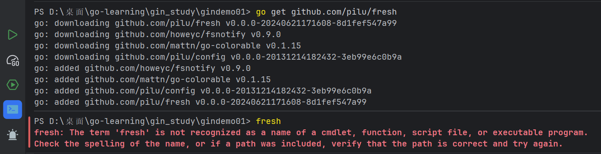
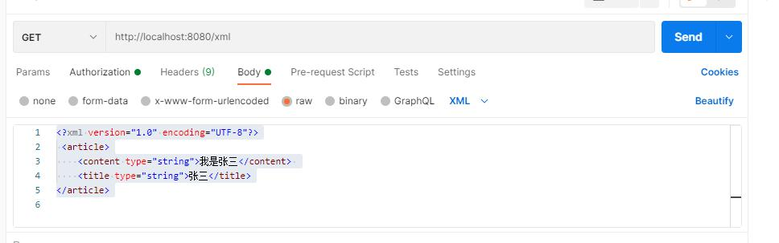

# 使用代理

```
https://goproxy.cn
```

使用 `https://goproxy.cn` 的核心原因非常直接：**它是目前在中国大陆访问速度最快、最稳定的 Go 模块代理。**

简单来说，如果你不使用这个代理，当你在 Go 代码中引入第三方库（比如 Gin 框架）时，`go get` 命令会尝试直接去 GitHub 等境外网站下载代码。由于网络环境的特殊性，这个过程往往会非常慢，甚至直接连接超时失败。

# 初始化 Go 模块

```go
go mod init gin_study
```

在开始学习 Gin 框架前执行 `go mod init gin_study`，是**初始化 Go 模块**的标准操作，目的是为项目建立依赖管理体系，让后续引入 Gin 等第三方库时能自动下载、版本可控、避免冲突。这一步是现代 Go 开发的“地基”，没有它，你无法顺利使用任何外部框架。

# go mod 常用指令

| 指令                   | 作用说明                                               | 常用示例                                 |
| ---------------------- | ------------------------------------------------------ | ---------------------------------------- |
| `go mod init <名称>`   | 初始化模块，创建 `go.mod` 文件（项目第一步必做）。     | `go mod init gindemo01`                  |
| `go mod tidy`          | 自动添加缺失依赖、移除无用依赖，保持文件整洁。         | `go mod tidy`                            |
| `go get <包>@<版本>`   | 下载指定包并更新到 `go.mod`，可指定版本号。            | `go get github.com/gin-gonic/gin@v1.9.1` |
| `go get -u`            | 将项目中所有依赖升级到最新的兼容版本。                 | `go get -u`                              |
| `go mod download`      | 仅下载依赖到本地缓存，不修改代码或文件。               | `go mod download`                        |
| `go list -m all`       | 列出当前模块及所有直接/间接依赖的版本信息。            | `go list -m all`                         |
| `go mod graph`         | 打印完整的依赖关系图，用于排查冲突。                   | `go mod graph`                           |
| `go mod vendor`        | 将所有依赖复制到项目内的 `vendor` 目录（离线构建用）。 | `go mod vendor`                          |
| `go mod edit -replace` | 在 `go.mod` 中添加替换规则（常用于本地调试）。         | `go mod edit -replace=old=new`           |

# 一、Gin 介绍

Gin 是一个 Go (Golang) 编写的轻量级 http web 框架，运行速度非常快，如果你是性能和高效的追求者，我们推荐你使用 Gin 框架。

Gin 最擅长的就是 Api 接口的高并发，如果项目的规模不大，业务相对简单，这个时候我们也推荐您使用 Gin。

当某个接口的性能遭到较大挑战的时候，这个还是可以考虑使用 Gin 重写接口。

Gin 也是一个流行的 golang Web 框架，Github Strat 量已经超过了 50k。

Gin 的官网：https://gin-gonic.com/zh-cn/

Gin Github 地址：https://github.com/gin-gonic/gin

# 二、Gin 环境搭建

要安装 Gin 软件包，需要先安装 Go 并设置 Go 工作区。

**现代 Go 工具链（1.16+）默认要求所有项目必须在模块模式下运行。**

1. **进入你的项目目录**
   先创建一个项目文件夹并进入：

   ```
   mkdir my-gin-project
   cd my-gin-project
   ```

2. **初始化 Go 模块**
   在项目根目录执行：

   ```
   go mod init my-gin-project
   ```

   这会生成一个 `go.mod` 文件，它是 Go 项目的依赖管理核心。

3. **安装 Gin 框架**
   现在可以安全地安装 Gin：

   ```
   go get -u github.com/gin-gonic/gin
   ```

## 1.下载并安装 gin：

```
$ go get -u github.com/gin-gonic/gin
```

## 2.将 gin 引入到代码中：

```
import "github.com/gin-gonic/gin" 
```

## 3.（可选）如果使用诸如 http.StatusOK 之类的常量，则需要引入 net/http 包：

```
import "net/http" 
```

http.StatusOK等价于200的状态码

## 4.新建 Main.go 配置路由

```go
package main
import (
    "github.com/gin-gonic/gin"
)
func main() {
    // 创建一个默认的路由引擎
    r := gin.Default()
    // 配置路由
    r.GET("/", func(c *gin.Context) {
        c.JSON(200, gin.H{ // c.JSON：返回 JSON 格式的数据
            "message": "Hello world!", })
    })
    // 启动 HTTP 服务，默认在 0.0.0.0:8080 启动服务
    r.Run()
}
```

## 5.运行你的项目

```
$ go run main.go
```

## 6.要改变默认启动的端口

```
r.Run(":9000")
```

如果 go get 失败请参考：
http://bbs.itying.com/topic/5ed08edee7c0790f8475e276

# 三、golang 程序的热加载

所谓热加载就是当我们对代码进行修改时，程序能够自动重新加载并执行，这在我们开发中是非常便利的，可以快速进行代码测试，省去了每次手动重新编译

beego 中我们可以使用官方给我们提供的 bee 工具来热加载项目，但是 gin 中并没有官方提供的热加载工具，这个时候我们要实现热加载就可以借助第三方的工具。

工具 1（推荐）：https://github.com/gravityblast/fresh

```
go get github.com/pilu/fresh
D:\gin_demo>fresh
```

工具 2：https://github.com/codegangsta/gin

```
go get -u github.com/codegangsta/gin
D:\gin_demo>gin run main.go
```

## 遇到的问题



你遇到的 `fresh: The term 'fresh' is not recognized...` 错误，是因为 **Fresh 工具虽然已下载依赖包，但其可执行文件（fresh.exe）未被正确安装到系统 PATH 环境变量中**，导致终端无法识别该命令。这是 Go 1.16+ 版本后使用 `go get` 安装命令行工具的常见问题。

### **解决方案（推荐按顺序操作）**

#### **第一步：使用** `go install` **安装 Fresh（关键步骤）**

在终端中执行以下命令，将 Fresh 编译并安装到 Go 的 bin 目录：

```
go install github.com/pilu/fresh@latest
```

> ✅ 这一步会将 `fresh.exe` 安装到 `$GOPATH/bin` 或 `$GOBIN` 目录下（通常是 `C:\Users\你的用户名\go\bin`）。

#### **第二步：确认安装路径并添加到系统 PATH**

1. 打开 PowerShell 或 CMD，执行：

   ```
   go env GOPATH
   ```

   你会看到类似 `C:\Users\你的用户名\go` 的路径。

2. 将 `C:\Users\你的用户名\go\bin` 添加到系统环境变量 `PATH` 中：

   - 右键“此电脑” → “属性” → “高级系统设置” → “环境变量”。
   - 在“用户变量”或“系统变量”中找到 `Path`，点击“编辑”。
   - 新建一条，填入 `C:\Users\你的用户名\go\bin`（请替换为你的实际路径）。
   - 点击“确定”保存。

3. **重启终端**（PowerShell/CMD），使环境变量生效。

#### **第三步：验证安装成功**

在新终端中输入：

```
fresh --version
```

如果输出版本号（如 `v0.0.0-20240621171608-8d1fef547a99`），说明安装成功。

------

### **为什么** `go get` **不行？**

从 Go 1.17 开始，`go get` 不再自动将可执行文件安装到 `GOPATH/bin`，它只负责下载依赖包。要安装命令行工具，必须使用 `go install`。

------

### **额外建议：配置 GO111MODULE**

如果你的项目是模块模式（有 `go.mod`），建议显式设置：

```
go env -w GO111MODULE=on
```

这可以避免一些兼容性问题。

# 四、Gin 框架中的路由

## 4.1、路由概述

路由（Routing）是由一个 URI（或者叫路径）和一个特定的 HTTP 方法（GET、POST 等）组成的，涉及到应用如何响应客户端对某个网站节点的访问。

RESTful API 是目前比较成熟的一套互联网应用程序的 API 设计理论，所以我们设计我们的路由的时候建议参考 RESTful API 指南。

在 RESTful 架构中，每个网址代表一种资源，不同的请求方式表示执行不同的操作：

| GET（SELECT）        | 从服务器取出资源（一项或多项）                     |
| -------------------- | :------------------------------------------------- |
| **POST（CREATE）**   | **在服务器新建一个资源**                           |
| **PUT（UPDATE）**    | **在服务器更新资源（客户端提供改变后的完整资源）** |
| **DELETE（DELETE）** | **从服务器删除资源**                               |

### **📌 一句话总结**

- **GET** = 查（只读，不改变数据）
- **POST** = 增（创建新数据）
- **PUT** = 改（替换/更新现有数据）
- **DELETE** = 删（移除数据）

## 4.2、简单的路由配置

**简单的路由配置**(可以通过 postman 测试)
当用 GET 请求访问一个网址的时候，做什么事情：

```go
r.GET("网址", func(c *gin.Context) {
    c.String(200, "Get")
})
```

当用 POST 访问一个网址的时候，做什么事情：

```go
r.POST("网址", func(c *gin.Context) {
    c.String(200, "POST")
})
```

当用 PUT 访问一个网址的时候，执行的操作：

```go
r.PUT("网址", func(c *gin.Context) {
    c.String(200, "PUT")
})
```

当用 DELETE 访问一个网址的时候，执行的操作：

```go
r.DELETE("网址", func(c *gin.Context) {
    c.String(200, "DELETE")
})
```

**路由里面获取 Get 传值**
域名/news?aid=20

```go
r.GET("/news", func(c *gin.Context) {
    aid := c.Query("aid")
    c.String(200, "aid=%s", aid)
})
```

**动态路由**
域名/user/20

```go
r.GET("/user/:uid", func(c *gin.Context) {
    uid := c.Param("uid")
    c.String(200, "userID=%s", uid)
})
```

## 4.3、 c.String() c.JSON() c.JSONP() c.XML() c.HTML()

| 方法         | 返回格式 | Content-Type             | 主要用途                              |
| ------------ | -------- | ------------------------ | ------------------------------------- |
| `c.String()` | 纯文本   | `text/plain`             | 简单消息、调试输出                    |
| `c.JSON()`   | JSON     | `application/json`       | API 数据返回，前后端分离最常用        |
| `c.JSONP()`  | JSONP    | `application/javascript` | 解决跨域请求（通过回调函数包裹 JSON） |
| `c.XML()`    | XML      | `application/xml`        | 旧系统对接、RSS 订阅、SOAP 服务       |
| `c.HTML()`   | HTML     | `text/html`              | 服务端渲染页面（需提前加载模板）      |

**返回一个字符串**

```go
r.GET("/news", func(c *gin.Context) {
    aid := c.Query("aid")
    c.String(200, "aid=%s", aid)
})
```

**返回一个 JSON 数据**

```go
func main() {
    r := gin.Default()
    // gin.H 是 map[string]interface{}的缩写
    r.GET("/someJSON", func(c *gin.Context) {
        // 方式一：自己拼接 JSON
        c.JSON(http.StatusOK, gin.H{"message": "Hello world!"})
    })
    r.GET("/moreJSON", func(c *gin.Context) {
        // 方法二：使用结构体
        var msg struct {
            Name string `json:"user"` Message string
            Age int
        }
        msg.Name = "IT 营学院" msg.Message = "Hello world!" msg.Age = 18
        c.JSON(http.StatusOK, msg)
    })
    r.Run(":8080")
}
```

**JSOPN**

```go
func main() {
    r := gin.Default()
    r.GET("/JSONP", func(c *gin.Context) {
        data := map[string]interface{}{ "foo": "bar", }
        // /JSONP?callback=x
        // 将输出：x({\"foo\":\"bar\"})
        c.JSONP(http.StatusOK, data)
    })

    // 监听并在 0.0.0.0:8080 上启动服务
    r.Run(":8080")
}
```

**返回 XML 数据**

```go
func main() {
    r := gin.Default()
    // gin.H 是 map[string]interface{}的缩写
    r.GET("/someXML", func(c *gin.Context) {
        // 方式一：自己拼接 JSON
        c.XML(http.StatusOK, gin.H{"message": "Hello world!"})
    })
    r.GET("/moreXML", func(c *gin.Context) {
        // 方法二：使用结构体
        type MessageRecord struct {
            Name string
            Message string
            Age int
        }
        var msg MessageRecord
        msg.Name = "IT 营学院" msg.Message = "Hello world!" msg.Age = 18
        c.XML(http.StatusOK, msg)
    })
    r.Run(":8080")
}
```

**渲染模板**

```go
router.GET("/", func(c *gin.Context) {
    c.HTML(http.StatusOK, "default/index.html", map[string]interface{}{ 
        "title": "前台首页"
    })
})
```

# 五、Gin HTML 模板渲染

## 5.1、全部模板放在一个目录里面的配置方法

### 1、我们首先在项目根目录新建 templates 文件夹，然后在文件夹中新建 index.html

```html
<!DOCTYPE html>
<html lang="en">
    <head>
        <meta charset="UTF-8">
        <meta http-equiv="X-UA-Compatible" content="IE=edge">
        <meta name="viewport" content="width=device-width, initial-scale=1.0">
        <title>Document</title>
    </head>
    <body>
        <h1>这是一个 html 模板</h1>
        <h3>{{.title}}</h3>
    </body>
</html>
```

### 2、Gin 框架中使用 c.HTML 可以渲染模板，渲染模板前需要使用 LoadHTMLGlob()或者LoadHTMLFiles()方法加载模板。

```go
router.GET("/", func(c *gin.Context) {
    c.HTML(http.StatusOK, "default/index.html", map[string]interface{}{ "title": "前台首页"
                                                                      })
})
router.GET("/", func(c *gin.Context) {
    c.HTML(http.StatusOK, "index.html", gin.H{ "title": "Main website", })
})
```

```go
package main
import ( 
    "net/http"
    "github.com/gin-gonic/gin"
)
func main() {
    router := gin.Default()
    router.LoadHTMLGlob("templates/*")
    //router.LoadHTMLFiles("templates/template1.html", "templates/template2.html")
    router.GET("/", func(c *gin.Context) {
        c.HTML(http.StatusOK, "index.html", gin.H{ "title": "Main website", })
    })
    router.Run(":8080")
}
```

| 特性     | `r.LoadHTMLGlob`           | `r.LoadHTMLFiles`        |
| -------- | -------------------------- | ------------------------ |
| 加载方式 | 批量、按模式匹配           | 手动、逐个指定           |
| 灵活性   | 高，适合目录化管理         | 低，但非常精确           |
| 适用场景 | 模板文件较多，且按目录组织 | 模板文件较少，或位置分散 |

```go
// 加载 templates 目录下的所有文件
r.LoadHTMLGlob("templates/*")

// 加载 templates 目录下所有 .html 后缀的文件
r.LoadHTMLGlob("templates/*.html")

// 加载 templates 目录及其所有子目录下的 .html 文件
r.LoadHTMLGlob("templates/**/*.html")
```

```go
// 加载两个指定的文件
r.LoadHTMLFiles("templates/index.html", "templates/user/profile.html")

// 也可以只加载一个文件
r.LoadHTMLFiles("templates/home.html")
```


## 5.2、模板放在不同目录里面的配置方法

Gin 框架中如果不同目录下面有同名模板的话我们需要使用下面方法加载模板
**注意：定义模板的时候需要通过 define 定义名称**
templates/admin/index.html
<!-- 相当于给模板定义一个名字 define end 成对出现-->

```html
{{ define "admin/index.html" }}
<!DOCTYPE html>
<html lang="en">
    <head>
        <meta charset="UTF-8">
        <meta http-equiv="X-UA-Compatible" content="IE=edge">
        <meta name="viewport" content="width=device-width, initial-scale=1.0">
        <title>Document</title>
    </head>
    <body>
        <h1>后台模板</h1>
        <h3>{{.title}}</h3>
    </body>
</html>
{{ end }}
```

templates/default/index.html
<!-- 相当于给模板定义一个名字 define end 成对出现-->

```html
{{ define "default/index.html" }}
<!DOCTYPE html>
<html lang="en">
    <head>
        <meta charset="UTF-8">
        <meta http-equiv="X-UA-Compatible" content="IE=edge">
        <meta name="viewport" content="width=device-width, initial-scale=1.0">
        <title>Document</title>
    </head>
    <body>
        <h1>前台模板</h1>
        <h3>{{.title}}</h3>
    </body>
</html>
{{end}}
```

**业务逻辑**

```go
package main
import ( 
    "net/http"
    "github.com/gin-gonic/gin"
)
func main() {
    router := gin.Default()
    router.LoadHTMLGlob("templates/**/*")
    router.GET("/", func(c *gin.Context) {
        c.HTML(http.StatusOK, "default/index.html", gin.H{ "title": "前台首页", })
    })
    router.GET("/admin", func(c *gin.Context) {
        c.HTML(http.StatusOK, "admin/index.html", gin.H{ "title": "后台首页", })
    })
    router.Run(":8080")
}
```

**注意：如果模板在多级目录里面的话需要这样配置 r.LoadHTMLGlob("templates///*") /** 表示目录**

## 5.3、gin 模板基本语法

### 1、{{.}} 输出数据

模板语法都包含在{{和}}中间，其中{{.}}中的点表示当前对象。
当我们传入一个结构体对象时，我们可以根据.来访问结构体的对应字段。例如：
**业务逻辑**

```go
package main
import ( 
    "net/http"
    "github.com/gin-gonic/gin"
)
type UserInfo struct {
    Name string
    Gender string
    Age int
}
func main() {
    router := gin.Default()
    router.LoadHTMLGlob("templates/**/*")
    user := UserInfo{
        Name: "张三", Gender: "男", Age: 18, }
    router.GET("/", func(c *gin.Context) {
        c.HTML(http.StatusOK, "default/index.html", map[string]interface{}{ 
            "title": "前台首页", 
            "user": user, 
        })

    })
    router.Run(":8080")
}
```

**模板**
<!-- 相当于给模板定义一个名字 define end 成对出现-->

```html
{{ define "default/index.html" }}
<!DOCTYPE html>
<html lang="en">
    <head>
        <meta charset="UTF-8">
        <meta http-equiv="X-UA-Compatible" content="IE=edge">
        <meta name="viewport" content="width=device-width, initial-scale=1.0">
        <title>Document</title>
    </head>
    <body>
        <h1>前台模板</h1>
        <h3>{{.title}}</h3>
        <h4>{{.user.Name}}</h4>
        <h4>{{.user.Age}}</h4>
    </body>
</html>
{{end}}
```

### 2、注释

```go
{{/* a comment */}}
```

注释，执行时会忽略。可以多行。注释不能嵌套，并且必须紧贴分界符始止。

### 3、变量

我们还可以在模板中声明变量，用来保存传入模板的数据或其他语句生成的结果。具体语法
如下：

```html
<h4>{{$obj := .title}}</h4>
<h4>{{$obj}}</h4>
```

### 4、移除空格

有时候我们在使用模板语法的时候会不可避免的引入一下空格或者换行符，这样模板最终渲染出来的内容可能就和我们想的不一样，这个时候可以使用{{-语法去除模板内容左侧的所有空白符号， 使用-}}去除模板内容右侧的所有空白符号。
例如：

```html
{{- .Name -}}
```

**注意**：-要紧挨{{和}}，同时与模板值之间需要使用空格分隔。

### 5、比较函数

布尔函数会将任何类型的零值视为假，其余视为真。
下面是定义为函数的二元比较运算的集合：
eq 如果 arg1 == arg2 则返回真
ne 如果 arg1 != arg2 则返回真
lt 如果 arg1 < arg2 则返回真
le 如果 arg1 <= arg2 则返回真
gt 如果 arg1 > arg2 则返回真
ge 如果 arg1 >= arg2 则返回真

### 6、条件判断

Go 模板语法中的条件判断有以下几种:

```html
{{if pipeline}} T1 {{end}}
{{if pipeline}} T1 {{else}} T0 {{end}}
{{if pipeline}} T1 {{else if pipeline}} T0 {{end}}
{{if gt .score 60}}
及格
{{else}}
不及格
{{end}}
{{if gt .score 90}}
优秀
{{else if gt .score 60}}
及格
{{else}}
不及格
{{end}}
```

### 7、range

Go 的模板语法中使用 range 关键字进行遍历，有以下两种写法，其中 pipeline 的值必须是数组、切片、字典或者通道。

```html
{{range $key,$value := .obj}}
{{$value}}
{{end}}
```

如果 pipeline 的值其长度为 0，不会有任何输出

```html
{{$key,$value := .obj}}
{{$value}}
{{else}}
pipeline 的值其长度为 0
{{end}}
```

如果 pipeline 的值其长度为 0，则会执行 T0。

```go
router.GET("/", func(c *gin.Context) {
    c.HTML(http.StatusOK, "default/index.html", map[string]interface{}{ 
        "hobby": []string{"吃饭", "睡觉", "写代码"}, 
    })
})
{{range $key,$value := .hobby}}
<p>{{$value}}</p>
{{end}}
```

### 8、With

```go
user := UserInfo{
    Name: "张三", Gender: "男", Age: 18, }
router.GET("/", func(c *gin.Context) {
    c.HTML(http.StatusOK, "default/index.html", map[string]interface{}{ 
        "user": user, 
    })
})
```

以前要输出数据：

```html
<h4>{{.user.Name}}</h4>
<h4>{{.user.Gender}}</h4>
<h4>{{.user.Age}}</h4>
```

现在要输出数据：

```html
{{with .user}}
<h4>姓名：{{.Name}}</h4>
<h4>性别：{{.user.Gender}}</h4>
<h4>年龄：{{.Age}}</h4>
{{end}}
```

简单理解：相当于 var .=.user

### 9、预定义函数 （了解）

执行模板时，函数从两个函数字典中查找：首先是模板函数字典，然后是全局函数字典。一般不在模板内定义函数，而是使用 Funcs 方法添加函数到模板里。

and
函数返回它的第一个 empty 参数或者最后一个参数；
就是说"and x y"等价于"if x then y else x"；所有参数都会执行；
or
返回第一个非 empty 参数或者最后一个参数；
亦即"or x y"等价于"if x then x else y"；所有参数都会执行；
not
返回它的单个参数的布尔值的否定
len
返回它的参数的整数类型长度
index
执行结果为第一个参数以剩下的参数为索引/键指向的值；
如"index x 1 2 3"返回 x[1][2][3]的值；每个被索引的主体必须是数组、切片或者字典。
print
即 fmt.Sprint
printf
即 fmt.Sprintf
println
即 fmt.Sprintln
html
返回与其参数的文本表示形式等效的转义 HTML。
这个函数在 html/template 中不可用。
urlquery
以适合嵌入到网址查询中的形式返回其参数的文本表示的转义值。
这个函数在 html/template 中不可用。
js
返回与其参数的文本表示形式等效的转义 JavaScript。
call
执行结果是调用第一个参数的返回值，该参数必须是函数类型，其余参数作为调用该函数的参数；
如"call .X.Y 1 2"等价于 go 语言里的 dot.X.Y(1, 2)；
其中 Y 是函数类型的字段或者字典的值，或者其他类似情况；
call 的第一个参数的执行结果必须是函数类型的值（和预定义函数如 print 明显不同）；
该函数类型值必须有 1 到 2 个返回值，如果有 2 个则后一个必须是 error 接口类型；
如果有 2 个返回值的方法返回的 error 非 nil，模板执行会中断并返回给调用模板执行者该错误；

```html
{{len .title}}
{{index .hobby 2}}
```

### 10、自定义模板函数

```go
router.SetFuncMap(template.FuncMap{ "formatDate": formatAsDate, })
```

```go
package main
import ( 
    "fmt"
    "html/template"
    "net/http"
    "time"
    "github.com/gin-gonic/gin"
)
func formatAsDate(t time.Time) string {
    year, month, day := t.Date()
    return fmt.Sprintf("%d/%02d/%02d", year, month, day)
}
func main() {
    router := gin.Default()
    //注册全局模板函数 注意顺序，注册模板函数需要在加载模板上面
    router.SetFuncMap(template.FuncMap{ "formatDate": formatAsDate, })
    //加载模板
    router.LoadHTMLGlob("templates/**/*")
    router.GET("/", func(c *gin.Context) {
        c.HTML(http.StatusOK, "default/index.html", map[string]interface{}{ "title": "前台首页", "now": time.Now(), })
    })
    router.Run(":8080")
}
{{.now | formatDate}}
或者
{{formatDate .now }}
```

## 5.4、嵌套 template

### 1、新建 templates/deafult/page_header.html

```html
{{ define "default/page_header.html" }}
<h1>这是一个头部</h1>
{{end}}
```

### 2、外部引入

注意：
1、引入的名字为 page_header.html 中定义的名字
2、引入的时候注意最后的点（.）

```html
{{template "default/page_header.html" .}}
```

```html
<!-- 相当于给模板定义一个名字 define end 成对出现-->
{{ define "default/index.html" }}
<!DOCTYPE html>
<html lang="en">
    <head>
        <meta charset="UTF-8">
        <meta http-equiv="X-UA-Compatible" content="IE=edge">
        <meta name="viewport" content="width=device-width, initial-scale=1.0">
        <title>Document</title>
    </head>
    <body>
        {{template "default/page_header.html" .}}
    </body>
</html>
{{end}}
```

# 六、静态文件服务

当我们渲染的 HTML 文件中引用了静态文件时,我们需要配置静态 web 服务

r.Static("/static", "./static") 前面的/static 表示路由 后面的./static 表示路径

```go
func main() {
    r := gin.Default()
    r.Static("/static", "./static")
    r.LoadHTMLGlob("templates/**/*")
    // ... r.Run(":8080")
}
<link rel="stylesheet" href="/static/css/base.css" />
```

# 七、路由详解

路由（Routing）是由一个 URI（或者叫路径）和一个特定的 HTTP 方法（GET、POST 等）组成的，涉及到应用如何响应客户端对某个网站节点的访问。

前面章节我们给大家介绍了路由基础以及路由配置，这里我们详细给大家讲讲路由传值、路由返回值

## 7.1、GET POST 以及获取 Get Post 传值

### 7.1.1、Get 请求传值

GET 	/user?uid=20&page=1

```go
router.GET("/user", func(c *gin.Context) {
    uid := c.Query("uid")
    page := c.DefaultQuery("page", "0")
    c.String(200, "uid=%v page=%v", uid, page)
})
```

### 7.1.2、动态路由传值

域名/user/20

```go
r.GET("/user/:uid", func(c *gin.Context) {
    uid := c.Param("uid")
    c.String(200, "userID=%s", uid)
})
```

### 7.1.3、Post 请求传值 获取 form 表单数据

定义一个 add_user.html 的页面

```html
{{ define "default/add_user.html" }}
<!DOCTYPE html>
<html lang="en">
    <head>
        <meta charset="UTF-8">
        <meta http-equiv="X-UA-Compatible" content="IE=edge">
        <meta name="viewport" content="width=device-width, initial-scale=1.0">
        <title>Document</title>
    </head>
    <body>
        <form action="/doAddUser" method="post">
            用户名：<input type="text" name="username" />
            密码: <input type="password" name="password" />
            <input type="submit" value="提交">
        </form>
    </body>
</html>
{{end}}
```

通过 c.PostForm 接收表单传过来的数据

```go
router.GET("/addUser", func(c *gin.Context) {
    c.HTML(200, "default/add_user.html", gin.H{})
})
router.POST("/doAddUser", func(c *gin.Context) {
    username := c.PostForm("username")
    password := c.PostForm("password")
    age := c.DefaultPostForm("age", "20")
    c.JSON(200, gin.H{ "usernmae": username, "password": password, "age": age, })
})
```

### 7.1.4、获取 GET POST 传递的数据绑定到结构体

为了能够更方便的获取请求相关参数，提高开发效率，我们可以基于请求的 Content-Type识别请求数据类型并利用反射机制自动提取请求中 QueryString、form 表单、JSON、XML 等参数到结构体中。 下面的示例代码演示了.ShouldBind()强大的功能，它能够基于请求自动提取 JSON、form 表单和 QueryString 类型的数据，并把值绑定到指定的结构体对象。

```go
//注意首字母大写
type Userinfo struct {
    Username string `form:"username" json:"user"` 
    Password string `form:"password" json:"password"` }
```

**Get 传值绑定到结构体**

/?username=zhangsan&password=123456

```go
router.GET("/", func(c *gin.Context) {
    var userinfo Userinfo
    if err := c.ShouldBind(&userinfo); err == nil {
        c.JSON(http.StatusOK, userinfo)
    } else {
        c.JSON(http.StatusBadRequest, gin.H{"error": err.Error()})
    }
})
```

返回数据
{"user":"zhangsan","password":"123456"}

**Post 传值绑定到结构体**

```go
router.POST("/doLogin", func(c *gin.Context) {
    var userinfo Userinfo
    if err := c.ShouldBind(&userinfo); err == nil {
        c.JSON(http.StatusOK, userinfo)
    } else {
        c.JSON(http.StatusBadRequest, gin.H{"error": err.Error()})
    }
})
```

返回数据
{"user":"zhangsan","password":"123456"}

### 7.1.5、获取 Post Xml 数据

在 API 的开发中，我们经常会用到 JSON 或 XML 来作为数据交互的格式，这个时候我们可以在 gin 中使用 c.GetRawData()获取数据。

```html
<?xml version="1.0" encoding="UTF-8"?>
<article>
    <content type="string">我是张三</content>
    <title type="string">张三</title>
</article>
```



```go
type Article struct {
    Title string `xml:"title"` Content string `xml:"content"` }
router.POST("/xml", func(c *gin.Context) {
    b, _ := c.GetRawData() // 从 c.Request.Body 读取请求数据
    article := &Article{}
    if err := xml.Unmarshal(b, &article); err == nil {
        c.JSON(http.StatusOK, article)
    } else {
        c.JSON(http.StatusBadRequest, err.Error())
    }
})
```

## 7.2、简单的路由组

https://gin-gonic.com/zh-cn/docs/examples/grouping-routes/

```go
func main() {
    router := gin.Default()
    // 简单的路由组: v1
    v1 := router.Group("/v1")
    {
        v1.POST("/login", loginEndpoint)
        v1.POST("/submit", submitEndpoint)
        v1.POST("/read", readEndpoint)
    }
    // 简单的路由组: v2
    v2 := router.Group("/v2")
    {
        v2.POST("/login", loginEndpoint)
        v2.POST("/submit", submitEndpoint)
        v2.POST("/read", readEndpoint)
    }
    router.Run(":8080")
}
```

